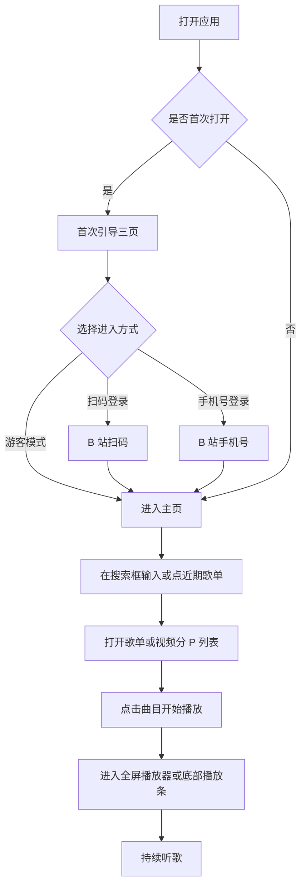
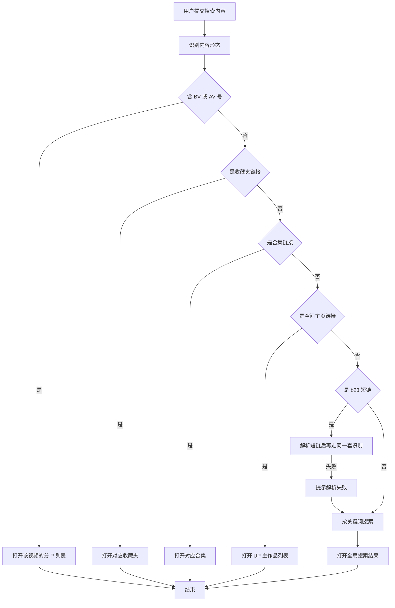
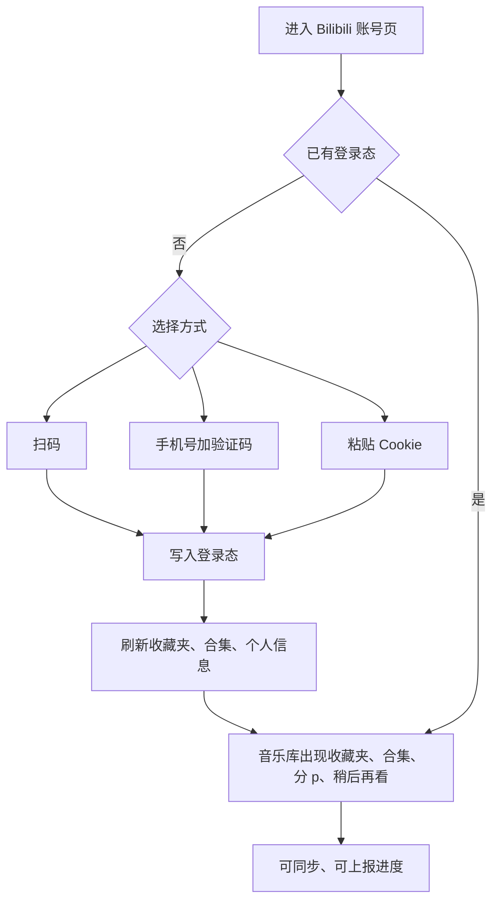
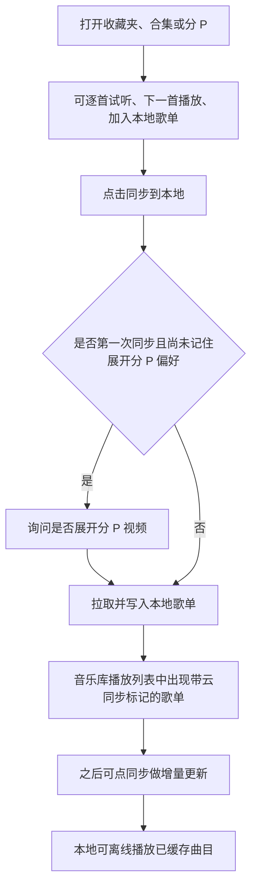
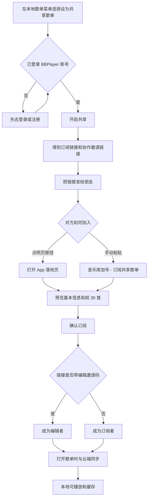
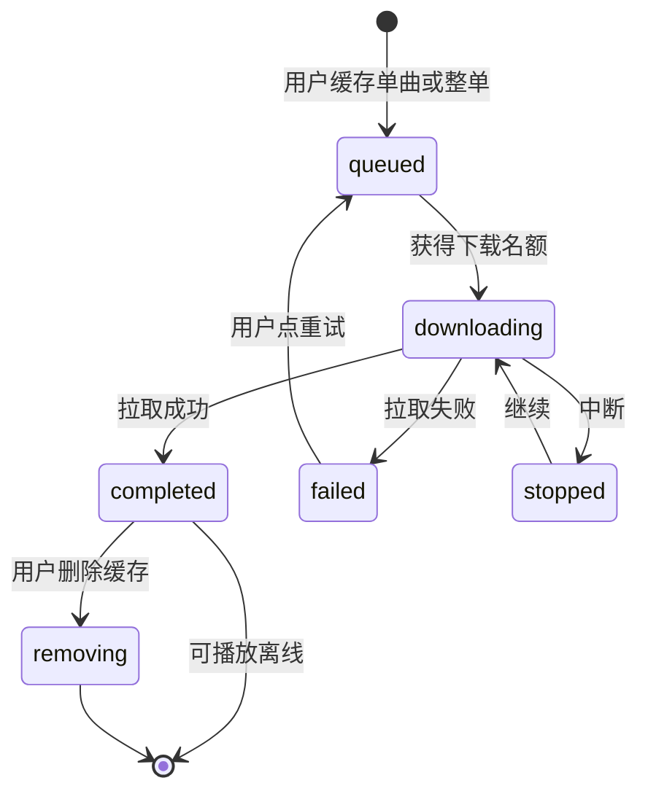
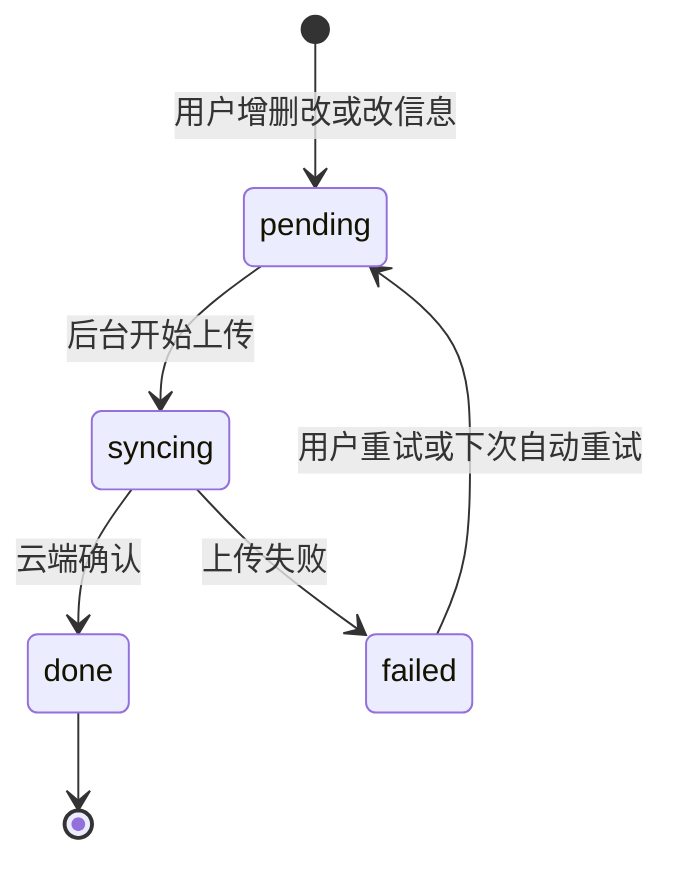
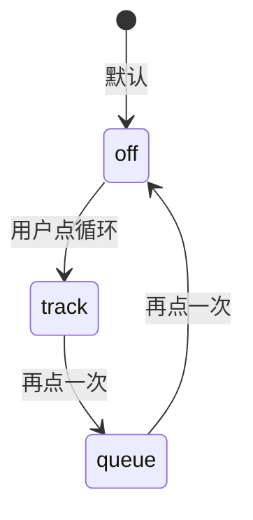

# BBPlayer 产品需求文档

> 文档读者：交互设计师、研发工程师、测试工程师  
> 覆盖范围：BBPlayer 移动端产品（以 Android 为交付主端）  
> 不包含：无入口可达的弹幕能力、开发者调试页中的非产品路径

---

## 产品概述

BBPlayer 是一款**本地优先的 Bilibili 音频播放器**。它面向习惯在 B 站听歌、听电台、听分 P 音频，却不想打开臃肿视频客户端的用户，把「搜歌、组歌单、听歌词、离线缓存」做成一套独立听歌体验。

产品要解决的核心问题是：B 站本身不是音乐 App。用户要听一首收藏夹里的歌，往往要打开视频页、看弹幕、等缓冲、被推荐流打断。BBPlayer 把 B 站稿件当作音频曲目来消费：用户可以用关键词、BV/AV 号、短链或空间页链接找到内容，组成自己的本地歌单，在锁屏、通知栏和桌面歌词中持续播放，并把喜欢的音频缓存下来离线听。

核心价值主张：

- **听歌，而不是看视频**：全功能播放器、队列、循环/随机、断点续播、响度均衡。
- **内容仍来自 B 站**：登录后可直接用收藏夹、合集、稍后再看；未登录也能搜索、打开公开链接、维护本地歌单。
- **歌词是一等公民**：自动匹配、逐字进度、翻译/罗马音、桌面歌词与状态栏歌词。
- **本地优先**：歌单、缓存、歌词、播放历史都落在本机；换机可通过备份包或共享歌单云端恢复。
- **可被装扮**：支持搜索并应用任意 B 站主题装扮，让导航栏、开屏、进度条拖拽图标、头像框等跟随皮肤变化。

目标用户：

| 角色         | 是谁                                                        | 主要诉求                                                  |
| ------------ | ----------------------------------------------------------- | --------------------------------------------------------- |
| 游客听歌用户 | 未登录 B 站、也未注册 BBPlayer 账号                         | 搜索公开内容、建本地歌单、听歌、下缓存                    |
| B 站登录用户 | 已用扫码/手机号/Cookie 登录 B 站                            | 收藏夹、合集、稍后再看、上报观看进度、把歌加回 B 站收藏夹 |
| 歌单协作者   | 已注册 BBPlayer 账号                                        | 把本地歌单共享给朋友，或订阅/协同编辑他人歌单             |
| 进阶玩家     | 需要桌面歌词、状态栏歌词、装扮、导出音频文件的 Android 用户 | 系统级歌词、主题、备份与导出                              |

产品边界：

- **主交付端是 Android**。iOS 曾做过基础适配，当前不保证可编译、功能不对等（无桌面歌词、频谱、无缝播放、响度均衡、批量导出等）。
- **没有付费墙**。捐赠为自愿打赏。
- **不替代 B 站客户端**：不提供投稿、私信、动态流；评论区仅浏览与点赞，不能发评。

---

## 用户故事

| 角色         | 用户故事                                                                                                                   |
| ------------ | -------------------------------------------------------------------------------------------------------------------------- |
| 游客听歌用户 | 作为游客，我想要跳过登录直接进入 App，以便在不愿承担账号风控风险时仍能搜歌、建歌单和听歌。                                 |
| 游客听歌用户 | 作为游客，我想要把关键词、BV/AV 号、b23 短链或空间页链接丢进搜索框，以便系统自动带我到对应内容而不是让我自己判断链接类型。 |
| 游客听歌用户 | 作为游客，我想要新建本地歌单并把搜到的歌加进去，以便形成自己的听歌清单。                                                   |
| 游客听歌用户 | 作为游客，我想要播放、暂停、切歌、循环、随机和看队列，以便获得完整的音乐播放器体验。                                       |
| 游客听歌用户 | 作为游客，我想要自动出现歌词，不准时能手动搜索或粘贴，以便跟唱和看翻译。                                                   |
| 游客听歌用户 | 作为游客，我想要缓存音频后在无网时继续听，以便通勤或飞行模式也能用。                                                       |
| 游客听歌用户 | 作为游客，我想要从网易云或 QQ 音乐歌单导入并匹配到 B 站视频，以便把已有歌单迁过来。                                        |
| B 站登录用户 | 作为 B 站用户，我想要用扫码、手机号或 Cookie 登录，以便看到自己的收藏夹、合集和稍后再看。                                  |
| B 站登录用户 | 作为 B 站用户，我想要把在线收藏夹同步成本地歌单，以便离线听、改显示名，并在 B 站侧内容变化时增量更新。                     |
| B 站登录用户 | 作为 B 站用户，我想要把本地歌单同步回 B 站收藏夹，以便在官方客户端也能看到这份清单。                                       |
| B 站登录用户 | 作为 B 站用户，我想要可选地上报观看进度，以便 B 站历史记录与本地播放保持一致。                                             |
| B 站登录用户 | 作为 B 站用户，我想要在播放页打开评论区并点赞，以便边听边看大家怎么说。                                                    |
| 歌单协作者   | 作为歌单主人，我想要登录 BBPlayer 账号后开启共享，以便把订阅链接或协作邀请发给朋友。                                       |
| 歌单协作者   | 作为订阅者，我想要点开分享链接或手动粘贴 ID 来订阅歌单，以便自动同步对方的更新。                                           |
| 歌单协作者   | 作为编辑者，我想要在共享歌单里加歌、删歌、改顺序，以便和朋友一起维护同一份清单。                                           |
| 进阶玩家     | 作为 Android 用户，我想要打开桌面歌词和状态栏歌词，以便切到别的 App 时仍能看到当前句。                                     |
| 进阶玩家     | 作为 Android 用户，我想要搜索并应用 B 站装扮，以便导航栏、开屏和头像框换成自己喜欢的皮肤。                                 |
| 进阶玩家     | 作为 Android 用户，我想要把已缓存歌曲导出成带封面和歌词的音频文件，以便给朋友或拷到其他播放器。                            |
| 进阶玩家     | 作为用户，我想要看听歌热力图和排行榜，以便回顾自己听了多久、听得最多的是哪几首。                                           |
| 所有用户     | 作为用户，我想要在设置里关闭匿名统计和崩溃上报，以便完全停止数据上传。                                                     |
| 所有用户     | 作为用户，我想要导出/导入备份包，以便换机或重装后恢复歌单和设置。                                                          |

---

## 核心业务概念

### 曲目来源

| 取值     | 含义                                                                                                             |
| -------- | ---------------------------------------------------------------------------------------------------------------- |
| Bilibili | 对应一个 B 站稿件。单 P 稿件整首对应一个视频；分 P 稿件每一 P 是一首独立曲目。                                   |
| 本地     | 仅作为元数据占位存在，当前产品不提供「导入本地音频文件当曲目」的完整能力。用户日常听到的几乎都是 Bilibili 来源。 |

### 歌单类型

| 取值           | 含义                                | 用户能做什么                                                                    |
| -------------- | ----------------------------------- | ------------------------------------------------------------------------------- |
| 本地歌单       | 完全由用户在本机构建的清单          | 增删改排序、改信息、缓存、共享、同步到 B 站                                     |
| 动态合并歌单   | 把多个源歌单实时拼在一起的只读视图  | 播放、搜索、下载、复制为普通本地歌单；不能直接改曲目、不能共享、不能同步到 B 站 |
| 收藏夹同步副本 | 从 B 站收藏夹拉下来的本地镜像       | 增量同步、改显示名/封面/描述、改歌曲显示名；不能直接增删曲目                    |
| 合集同步副本   | 从 B 站合集/季节拉下来的本地镜像    | 同上                                                                            |
| 分 P 同步副本  | 把一个分 P 视频拆成多首后的本地镜像 | 同上                                                                            |

### 在线内容入口（音乐库后三个页签）

| 页签   | 含义                                                                                  |
| ------ | ------------------------------------------------------------------------------------- |
| 收藏夹 | 当前 B 站账号下的收藏夹列表。标题以 `[mp]` 开头的夹不会出现在这里，改走「分 p」页签。 |
| 合集   | 当前账号订阅/追更的合集列表。                                                         |
| 分 p   | 来自标题以 `[mp]` 开头的收藏夹。点击其中视频进入分 P 列表，而不是直接当一首歌播放。   |

### 共享角色

| 取值   | 含义                                                                                             |
| ------ | ------------------------------------------------------------------------------------------------ |
| 创建者 | 开启共享的人。可改歌单信息、改曲目、重置协作邀请码、查看成员、删除云端歌单。开启后不可撤销共享。 |
| 编辑者 | 通过带邀请码的协作链接加入。可加歌、删歌、改顺序，不能改歌单标题/封面/描述，不能重置邀请码。     |
| 订阅者 | 通过普通订阅链接加入。只读同步，可播放和缓存，不能改内容。                                       |
| 未共享 | 普通本地歌单，不参与云端。                                                                       |

### 循环模式

用户每点一次循环按钮，按以下顺序切换：

| 取值     | 含义                   |
| -------- | ---------------------- |
| 关闭     | 播到队列末尾停止       |
| 单曲循环 | 当前曲目结束后从头再播 |
| 列表循环 | 队列播完后从第一首再来 |

随机播放是独立开关，与循环同时生效。打开随机后，切上一首/下一首按打乱后的逻辑顺序走。

### 下载任务状态

| 取值            | 含义                 | 用户可见表现                                              |
| --------------- | -------------------- | --------------------------------------------------------- |
| 排队中          | 已加入队列，等待空位 | 任务列表中显示等待                                        |
| 下载中          | 正在拉取音频         | 显示进度                                                  |
| 已完成          | 音频已写入本机缓存   | 曲目旁出现已缓存标记；播放器顶栏显示「正在播放 (已缓存)」 |
| 失败            | 拉取失败             | 可重试                                                    |
| 已停止          | 被中断，可恢复       | 可继续                                                    |
| 移除中 / 重启中 | 系统正在清理或重下   | 短暂过渡，用户不必单独操作                                |

### 歌词来源（自动匹配）

| 取值       | 含义                                                             |
| ---------- | ---------------------------------------------------------------- |
| 网易云音乐 | 默认。按标题和艺术家去网易云搜，支持逐字与罗马音的能力最完整。   |
| QQ 音乐    | 改走 QQ 音乐匹配。                                               |
| 酷狗音乐   | 改走酷狗匹配。                                                   |
| 自动       | 同时请求多个源，谁先返回用谁。**不比较匹配度**，结果不一定最好。 |

手动搜索歌词不受此设置限制。

### 歌词副轨

| 取值   | 含义                         |
| ------ | ---------------------------- |
| 主歌词 | 带时间轴的原文，决定滚动位置 |
| 翻译   | 对照译文                     |
| 罗马音 | 日语等歌曲的注音             |

用户可在歌词页切换「显示翻译」或「显示罗马音」。副轨只有在与主歌词时间轴匹配率足够时才会合并显示，否则丢弃副轨，避免错行。

### 播放器背景样式

| 取值     | 含义                                         |
| -------- | -------------------------------------------- |
| 渐变     | 默认。根据封面取色铺渐变背景。               |
| 默认背景 | 使用系统默认表面色，更接近 Material 默认页。 |

历史上存在过会明显拖慢性能的动态背景，存量用户会被自动退回「渐变」，并提示：「因为会对性能造成较大影响…已为您回退到渐变模式」。

### 底部播放条样式（仅 Android 设置中暴露）

| 取值         | 含义                         |
| ------------ | ---------------------------- |
| 悬浮（默认） | 播放条浮在内容上方           |
| 沉浸         | 播放条贴底，视觉上更融入页面 |

### 状态栏歌词框架（仅 Android）

| 取值           | 含义                                                    |
| -------------- | ------------------------------------------------------- |
| 词幕           | 默认推荐。需安装并激活词幕模块后才能打开开关。          |
| SuperLyric     | 需安装 SuperLyric 模块。                                |
| 魅族状态栏歌词 | 走 Flyme 状态栏歌词能力，无需模块，但仅在对应系统有效。 |

### B 站扫码登录状态

| 取值         | 界面文案                    |
| ------------ | --------------------------- |
| 生成中       | 正在生成二维码…             |
| 等待扫码     | 等待扫码                    |
| 已扫码待确认 | 已扫码，等待确认            |
| 已过期       | 二维码已过期 / 二维码已失效 |
| 成功         | 登录成功                    |

### 手机号登录步骤

| 步骤       | 含义                 |
| ---------- | -------------------- |
| 输入手机号 | 填大陆手机号         |
| 人机验证   | 完成极验校验         |
| 输入验证码 | 填短信验证码         |
| 成功       | 写入登录态并进入产品 |

---

## 核心业务流程

### 总流程：从打开 App 到开始听歌

用户打开 BBPlayer 的目标永远是「尽快听到想听的内容」。系统用首次引导分流风险偏好，再用主页搜索把各种入口收成一个框，最后把选中的曲目送进统一播放器。



流程说明：

1. 仅当本机标记「尚未完成首次打开」时进入引导。引导不可用手势直接划走结束，必须点「继续」或第三页的登录/游客按钮。
2. 扫码或手机号会先结束引导，再进入对应登录页；登录成功后用户回到主页。游客模式直接进主页，不写 B 站登录态。
3. 主页搜索、音乐库、系统分享、通知点击、分享链接，最终都汇入「打开一份歌单或曲目列表 → 点播」。
4. 只要队列里有当前曲目，底部会出现播放条；点播放条进入全屏播放器。

### 分支：智能搜索如何决定去哪

搜索框不是「只有关键词搜索」。用户从 B 站复制的分享文案经常夹杂标题、短链和无关文字，产品选择「尽量猜」而不是让用户先选类型。



流程说明：

- 只有「被当成普通关键词」的搜索会写入「最近搜索」，最多保留 10 条。BV/链接直达不记历史，避免历史里堆满无意义链接。
- 收藏夹链接若缺少类型参数，提示：「链接中未找到 ctype 参数，你确定复制全了吗？」
- 短链解析失败提示：「解析 b23.tv 短链接失败」或「未能从短链解析出已识别内容（BV/作者/收藏等）」。
- AV 号解析失败提示：「解析 avid 失败」。
- Android 从 B 站 App「分享到 BBPlayer」时，按单条文本处理；一次分享多条内容会提示「收到多个共享内容，已忽略」。

### 分支：登录 B 站后解锁在线库



未登录时，音乐库的「收藏夹 / 合集 / 分 p」页签展示登录引导：「登录 bilibili 账号后才能查看合集」（三个需登录页签共用同一段引导）以及「登录」按钮。游客仍可搜索公开内容、打开他人收藏夹/合集链接。

### 分支：在线内容变成可离线的本地歌单

在线页签的定位是「试听和浏览」，不是完整歌单编辑器。用户若要离线、改名、长期听，需要同步成本地歌单。



### 分支：共享歌单

共享走的是 **BBPlayer 账号**，与 B 站登录相互独立。开启后不能撤销。



---

## 状态流转

### 下载任务



状态说明：

| 状态   | 含义         | 进入条件                     | 用户动作                           |
| ------ | ------------ | ---------------------------- | ---------------------------------- |
| 排队中 | 等待空位     | 加入下载队列                 | 可在下载任务页查看                 |
| 下载中 | 正在写入缓存 | 轮到该任务且未超过同时下载数 | 等待                               |
| 已完成 | 可离线播放   | 文件完整                     | 播放器显示已缓存；可删除缓存或导出 |
| 失败   | 未完成       | 网络/源失效等                | 「重试失败」                       |
| 已停止 | 可恢复的中断 | 进程被停                     | 再次触发下载                       |
| 移除中 | 正在删缓存   | 用户选删除缓存               | 完成后标记消失                     |

同时下载数量可在「设置 → 下载」配置，默认 **1 个（稳妥）**，可选 2、3、**6 个（最快）**。

### 共享同步队列

当创建者或编辑者改动共享歌单时，本地先改，再排队上传。



冲突策略：以「用户操作发生的时间」为准，后发生的改动覆盖先发生的（后写赢）。不是以谁先上传到服务器为准，避免离线编辑被在线编辑无条件盖掉。

若创建者删除了云端歌单，订阅端打开时会移除本地副本，并提示共享者已删除该歌单。

### 循环模式



---

## 功能清单

| 模块           | 能力摘要                                                      |
| -------------- | ------------------------------------------------------------- |
| 首次引导       | 欢迎、账号风险说明、扫码/手机号/游客三选一                    |
| 主页           | 问候、头像、搜索、热力图、快捷入口、近期歌单、清爽模式        |
| 智能搜索       | BV/AV、短链、收藏夹/合集/空间链接、关键词、搜索历史与建议     |
| 全屏播放器     | 播控、循环随机、队列、倍速、定时关闭、下载、评论入口          |
| 歌词           | 自动匹配、逐字、翻译/罗马音、编辑、偏移、桌面/状态栏/车载歌词 |
| 音乐库         | 播放列表 / 收藏夹 / 合集 / 分 p；已下载入口；排行榜入口       |
| 本地歌单       | 新建、编辑、排序、置顶、复制、删除、搜索曲目、整单缓存        |
| 动态合并歌单   | 多源只读合并、去重、复制为普通歌单                            |
| 在线内容       | 收藏夹/合集/分 P/稍后再看/UP 主作品/搜索结果；同步到本地      |
| 外部歌单导入   | 网易云 / QQ 音乐链接匹配到 B 站视频后存为本地歌单             |
| 共享歌单       | 开启共享、订阅、协作、成员、云同步、落地页                    |
| 下载与导出     | 任务队列、已下载管理、导出带封面歌词的音频文件                |
| 播放历史       | 周热力图、按日明细、全部统计排行、最近常听、那月今日          |
| 评论区         | 浏览精选/最新、看回复和图片、点赞；不能发评                   |
| 主题装扮       | 搜索 B 站装扮、下载资源、切换/删除、开屏与部件开关            |
| Bilibili 账号  | 扫码、手机号、Cookie、退出、上报观看进度                      |
| BBPlayer 账号  | 注册登录、资料、用 B 站资料填充、恢复云端共享歌单             |
| 外观与播放设置 | 频谱、清爽模式、播放条/背景、续播、响度、自动播放、混音       |
| 通用           | 隐私开关、展开分 P、日志、检查更新、封面补全、备份导入导出    |
| 更新           | 发现新版本、可选跳过、强制更新、安装未知来源                  |
| 关于与捐赠     | 版本、官网、GitHub、许可证、微信/支付宝打赏                   |
| 系统分享与深链 | 分享到 BBPlayer、通知点进播放器、共享歌单网页唤起             |

---

## 功能模块详述

### 1. 首次引导

用户第一次打开 App 时，还没有听歌心智，却必须先面对「要不要把 B 站账号交给第三方」。引导把品牌、风险和进入方式拆成三页，让不愿意登录的人也能用游客模式开始听。

#### 页面布局

```
┌─────────────────────────────┐
│  [返回]                     │  ← 第 2、3 页才有
│                             │
│         （主视觉）           │
│         标题                 │
│         说明文案             │
│         （第 3 页为三个按钮） │
│                             │
│         ● ○ ○               │
│         [ 继续 ]             │  ← 仅第 1、2 页
└─────────────────────────────┘
```

#### 三页内容

| 页  | 标题                | 正文/操作                                                                                                                                                         |
| --- | ------------------- | ----------------------------------------------------------------------------------------------------------------------------------------------------------------- |
| 1   | 欢迎使用 / BBPlayer | 「你的 BiliBili 音乐伴侣」换行「开源 · 简洁 · 纯粹」。主按钮「继续」。                                                                                            |
| 2   | 安全提示            | 说明即使谨慎调用 B 站能力，**仍不保证**账号安全；可能风控、短期或永久封禁。并说明选「游客模式」仍可使用本地播放列表、搜索、查看合集等大部分功能。主按钮「继续」。 |
| 3   | 准备开始            | 「扫码登录」（实心主按钮）、「手机号登录」（线框）、「游客模式」（线框、偏弱）。无「继续」。                                                                      |

#### 操作流程

- 点「继续」：进入下一页。
- 点返回：回到上一页。未完成引导时，系统返回键也按「回上一页」处理，避免误退到空白。
- 点「扫码登录」：结束引导，进入扫码页。
- 点「手机号登录」：结束引导，进入手机号登录页。
- 点「游客模式」：结束引导，进入主页。

成功：写入「已完成首次打开」，之后启动不再出现引导。  
失败：本页无网络请求，无失败提示。

---

### 2. 主页与智能搜索

主页承担「认识你、帮你找到下一首」两件事。问候和头像让已登录用户感到这是自己的库；搜索框则是全 App 最重要的入口，因为 B 站内容分散在视频、收藏夹、合集和空间页，用户不想先想清楚类型。

清爽模式是为「打开就要搜」的人准备的：关掉热力图、快捷入口和近期歌单，只留品牌、问候、头像和搜索，减少视觉噪音。

#### 页面布局（默认，非清爽）

```
┌─────────────────────────────┐
│ BBPlayer          [头像框]  │
│ 早上好，{昵称或陌生人}  [!] │  ← 有同步失败时显示告警
│ ┌─────────────────────────┐ │
│ │ 关键词 / b23.tv / ...   │ │
│ └─────────────────────────┘ │
│  （搜索聚焦时：建议或历史）  │
│                             │
│  [周热力图]                 │
│  那月今日  最近常听  稍后再看│  ← 稍后再看需已登录 B 站
│                             │
│  近期歌单                   │
│  [封面] 标题    n 首        │
│                             │
│ ════ 底部播放条（有曲时）══ │
│ 主页    音乐库    设置      │
└─────────────────────────────┘
```

#### 可见元素

| 元素            | 为什么存在                           | 行为                                                                                                   |
| --------------- | ------------------------------------ | ------------------------------------------------------------------------------------------------------ |
| 品牌名 BBPlayer | 确认当前 App                         | 展示                                                                                                   |
| 问候语          | 降低冷启动的工具感                   | 0–6 点「凌晨好」；6–12「早上好」；12–18「下午好」；18–24「晚上好」。后接「，{B 站昵称}」或「，陌生人」 |
| 头像            | 快速进入账号                         | 点击进入 Bilibili 账号页；若当前装扮含头像框则叠在头像上                                               |
| 同步失败告警    | 共享歌单上传失败时不能静默丢数据     | 点击打开失败列表，可重试                                                                               |
| 搜索框          | 统一入口                             | placeholder：「关键词 / b23.tv / 完整网址 / av / bv」                                                  |
| 周热力图        | 用「最近有没有听」促成回顾           | 点某一天进入当日听歌页                                                                                 |
| 那月今日        | 怀旧入口                             | 进入「一个月前同一天」的听歌记录                                                                       |
| 最近常听        | 不等用户建歌单也能连播常听           | 进入最近常听列表                                                                                       |
| 稍后再看        | 把 B 站稍后再看变成可连播清单        | 仅已登录 B 站时显示                                                                                    |
| 近期歌单        | 延续上次整理的上下文                 | 封面 + 标题 + 「n 首」，点进对应本地歌单                                                               |
| 底部播放条      | 切到主页、音乐库或设置时仍能继续控歌 | 见播放器模块                                                                                           |

清爽模式开启后：热力图、快捷入口、近期歌单全部隐藏，只保留顶部品牌/问候/头像与搜索框。

#### 搜索建议层

- 搜索框空、已聚焦：展示「最近搜索」。有历史则以标签展示；无历史显示「暂无搜索历史」。
- 清空全部：确认框标题「清空搜索历史？」正文「确定要清空吗？」按钮「取消 / 确定」。
- 长按一条：确认框标题「删除搜索历史？」正文「确定要删除「{该条文字}」吗？」
- 正在输入：展示 B 站搜索建议，匹配字高亮。
- 历史最多 10 条，重复提交会把该条提到最前。

#### 搜索提交规则与失败文案

见「核心业务流程 / 智能搜索」。提交时空内容不动作。

#### 系统分享入站

Android 收到多条分享：Toast「收到多个共享内容，已忽略」。  
iOS 为弹窗：「收到多个共享内容，已忽略」或「当前版本仅支持处理单个共享内容，已忽略其他内容」。

---

### 3. 全屏播放器与底部播放条

播放器是产品的「正在听」中枢。用户从列表点进一首歌后，需要的不是视频页，而是封面、进度、歌词、队列和一组听歌场景工具（定时关、倍速、下缓存、分享）。底部播放条保证切到主页/音乐库/设置时不必放弃控歌。

#### 进入方式

- 点击底部播放条
- 点击系统媒体通知
- 在歌词页返回后仍停在播放器

#### 底部播放条

存在价值：主页、音乐库、设置信息密度高，用户仍要随时暂停、切歌、打开队列。

- 展示当前封面、标题、作者（缺省「未知作者」）。
- 点击进入全屏播放器。
- 播放/暂停。
- 左右滑动切上一首/下一首。
- 上滑打开播放队列。
- 无当前曲目时不显示，页面底部留白收回。

#### 全屏播放器布局（主界面）

```
┌─────────────────────────────┐
│ [收起]  正在播放(已缓存) [更多]│
│                             │
│         [ 封面 ]            │
│                             │
│         歌曲标题             │
│         作者                 │
│ ────── 进度条 ────────────── │
│  随机   上一  播放  下一  循环│
│  评论                      队列│
└─────────────────────────────┘
```

向左/右滑动页面可进入歌词页。点封面也进入歌词页。

顶栏状态：

- 默认：「正在播放」
- 当前曲已缓存：「正在播放 (已缓存)」

主界面在歌词页时，左上角由「收起」改为「返回主界面」。

#### 主控

| 控件            | 行为                                  | 失败             |
| --------------- | ------------------------------------- | ---------------- |
| 播放/暂停       | 切换播放状态；缓冲中播放键显示等待    | 见播放错误文案   |
| 上一曲 / 下一曲 | 按循环与随机规则切歌                  | 队列为空则无效果 |
| 随机            | 开/关                                 | —                |
| 循环            | 关 → 单曲 → 列表 → 关                 | —                |
| 评论            | 仅 B 站来源曲目显示，进入该视频评论区 | —                |
| 队列            | 打开「播放队列 (n)」                  | —                |

#### 更多菜单

高频区：「倍速」「定时关闭」「下载」或「重新下载」。

列表项：

| 项                     | 何时出现 | 做什么                 |
| ---------------------- | -------- | ---------------------- |
| 添加到 bilibili 收藏夹 | B 站曲   | 选出收藏夹并添加       |
| 添加到本地歌单         | 始终     | 勾选一个或多个本地歌单 |
| 编辑信息               | 始终     | 改显示标题等           |
| 查看作者               | 始终     | 打开 UP 主作品页       |
| 查看视频详情           | B 站曲   | 打开该视频分 P 列表    |
| 搜索歌词               | 始终     | 手动搜歌词             |
| 分享歌词               | 始终     | 选句生成长图           |
| 分享歌曲               | 始终     | 生成歌曲卡片           |

相关提示：

- 查看作者失败：「获取视频详细信息失败」
- 加入下载：「已添加到下载队列」
- 取流失败：「获取内部播放地址失败」
- 下载失败：「下载音频失败」

分享歌曲仅支持 B 站来源，否则：「当前仅支持分享 Bilibili 来源的歌曲」。

#### 播放队列

存在价值：用户常从搜索「随便点几首」或从多个歌单插队，需要一个当前会话清单，而不是被某个歌单绑死。

- 标题「播放队列 (n)」
- 点某一首：跳到该曲播放
- 移除某一首：从队列删除，不删歌单里的歌
- 保存队列：存成新的本地歌单
- 作者缺省展示「未知作者」
- 若试图把多首一次性「下一首播放」：提示「只能将单曲插入到下一首播放，已取消本次操作。」
- 成功插队：「添加到下一首播放成功」

从列表点播可能**替换整个队列**。若会替换，弹出：「点击列表中的单曲会直接替换当前播放列表，是否继续？」可勾选下次不再提醒。

无可播曲目：「没有可播放的歌曲」。

#### 倍速

弹层标题「播放速度」。预设 0.5 / 0.75 / 1.0 / 1.25 / 1.5 / 2.0。展示「当前: {x}x」。可自定义，范围 0.1–5.0。非法输入：「请输入有效的播放速度」。

#### 定时关闭

睡前听歌时，用户希望「再听一会儿就停」，而不是被下一首吵醒。

预设 15 / 30 / 45 / 60 分钟，可自定义。运行中显示「剩余 HH:MM:SS」。到点**暂停**（不是退出 App）。

成功：「设置定时器成功」「取消定时器成功」。

#### 播放错误（系统侧）

| 场景               | 提示                                          |
| ------------------ | --------------------------------------------- |
| B 站弹出验证码     | Bilibili 触发验证码，请尝试重新登录或稍后再试 |
| 未登录且源需要登录 | Bilibili 账号未登录                           |
| 大会员/下架/无流   | 无法获取音频流，可能需要大会员或该歌曲已下架  |
| 离线且未缓存       | 当前歌曲未缓存，离线状态下无法播放            |
| 网络失败           | 网络连接失败，请检查网络设置                  |
| 其他               | 播放器发生未知错误                            |

登录态失效时还会提示「登录状态失效，请重新登录」，并引导去扫码页。

---

### 4. 歌词

B 站音源通常没有官方逐字歌词，用户却非常依赖歌词跟唱、看翻译、在锁屏外看到当前句。歌词模块把「自动找」「不准就改」「显示到系统各处」分成三层，避免听歌时还要跳出 App 搜歌词。

#### 歌词页布局

```
┌─────────────────────────────┐
│ [返回]              [菜单]  │
│                             │
│      上一句                 │
│    ▶ 当前句 逐字高亮        │
│      翻译或罗马音            │
│      下一句                 │
│                             │
│              [编辑] [偏移]  │
└─────────────────────────────┘
```

加载中显示等待。失败：「歌词加载失败：{原因}」。  
解析不出时间轴时，回退为「原始歌词：」「翻译歌词：」纯文本。

点某一行：跳转到该句时间。  
长按行：进入分享选句（也可从更多菜单「分享歌词」进入）。

菜单：「切换罗马音」/「切换翻译」、「编辑歌词」、「时间轴偏移」。

#### 自动匹配

播放时按标题和艺术家，到用户选定的歌词源请求。命中后缓存到本地，下次同曲不必再请求。离线且无缓存时，歌词页展示错误信息而非空白。

用户清除歌词后，该曲标记为「跳过自动获取」，避免每次播放又把不想要的歌词抓回来。手动搜索或重新编辑会去掉该标记。

#### 手动搜索 / 编辑

编辑弹层字段：

| 字段   | 含义                                     |
| ------ | ---------------------------------------- |
| 主歌词 | 带时间轴的原文，遵循 SPL（兼容普通 LRC） |
| 翻译   | 对照译文                                 |
| 罗马音 | 注音                                     |

保存成功：「歌词保存成功」。  
清除成功：「歌词已清除」。清除前确认：清除后会标记该歌曲跳过自动歌词获取。  
格式错误：提示具体问题，可选择「仍要保存」。

偏移以 0.5 秒为步进，用于校正 B 站音源与歌词源的时间差。

分享歌词：最多选择 5 句。未选时：「请先选择歌词」。超限：「最多选择 5 句歌词」。生成长图后可分享或保存相册。无相册权限：「请允许访问相册」。成功：「已保存到相册」。

#### 桌面歌词（Android）

让用户把 BBPlayer 切到后台或去看别的 App 时，仍能在悬浮窗看到当前句，并点歌词面板切歌/暂停。

开启路径：设置 → 歌词 → 「桌面歌词」。

无悬浮窗权限时弹窗：

- 标题「桌面歌词」
- 正文「启用桌面歌词需要启用悬浮窗权限。跳转到设置后，请找到 BBPlayer，并允许显示悬浮窗」
- 按钮「取消 / 去设置」

若用户曾经开启，但启动时发现权限没了：

- 标题「桌面歌词」
- 正文「检测到桌面歌词已开启，但缺少悬浮窗权限，请授权以恢复显示。」
- 按钮「取消 / 去授权」

「桌面歌词锁定」打开后悬浮窗不可拖动，防止误触。  
用户可在悬浮窗上调字号、颜色，并控制播放、上一曲、下一曲。

#### 车载歌词（Android）

开启后把当前歌词写到系统媒体信息的标题位置，便于车机/蓝牙上显示的是歌词而不是歌曲名。说明文案：「启用后会把当前歌词显示到媒体信息的标题部分」。

#### 状态栏歌词（Android）

把当前句推到系统状态栏，适合已经在用词幕、Flyme 或 SuperLyric 的用户。

- 框架未就绪时开关禁用，文案追加「（需安装词幕模块）」「（仅支持 Flyme / 魅族状态栏歌词）」或「（需安装 SuperLyric 模块）」；词幕未连接时选项显示「（未连接）」；SuperLyric 未激活显示「（未激活）」。
- 并显示可点击说明：「未检测到可用环境，请点击查看配置文档」，打开官网歌词指南的状态栏章节。

设置失败统一：「设置失败」或「设置桌面歌词失败」。

#### 歌词设置项与默认

| 项               | 默认       | 说明                                                                                                     |
| ---------------- | ---------- | -------------------------------------------------------------------------------------------------------- |
| 显示逐字歌词     | 开         | 有逐字数据时按字推进；主要来自网易云源                                                                   |
| 恢复旧版歌词样式 | 关         | 切回旧版排版                                                                                             |
| 自动匹配的歌词源 | 网易云音乐 | 不影响手动搜索。选「自动」时额外说明：选择最先返回的数据源，但不会考虑匹配度，所以不保证结果一定是最好的 |

---

### 5. 音乐库

音乐库把「我自己整理的」和「B 站账号里已经有的」放在同一层，避免用户记住两套入口。四个页签的分工是：播放列表管本地资产；后三个页签是 B 站在线视图。

右上角两个图标解决高频跳转：下载管理（已缓存资产）、奖杯（听歌统计）。二者都不属于某个页签，所以放在库的全局头上。

#### 页面布局

```
┌─────────────────────────────┐
│ 音乐库          [下载] [奖杯]│
│ 播放列表 收藏夹 合集 分 p    │
│                             │
│  {页签标题}    {n} 个…      │
│  [搜索框]              [+]  │  ← 仅播放列表有加号
│  列表项…                    │
│                             │
│ ════ 底部播放条 ════════════ │
└─────────────────────────────┘
```

#### 播放列表页签

- 标题「播放列表」，计数「{n} 个播放列表」
- 搜索框「搜索播放列表」
- 空态「没有播放列表」
- 加载失败「加载失败」
- 已登录 B 站时，列表顶部有虚拟项「稍后再看」（不是本地库里的一条记录，而是跳转到 B 站稍后再看）
- 置顶的本地歌单排在前面

加号菜单：

| 项           | 作用                       |
| ------------ | -------------------------- |
| 新建播放列表 | 创建空的本地歌单           |
| 导入外部歌单 | 网易云 / QQ 匹配流程       |
| 订阅共享歌单 | 粘贴链接或 ID              |
| 动态合并歌单 | 选至少两个源歌单做只读合并 |

新建弹层标题「创建播放列表」，按钮「取消 / 确定」。

| 字段 | 是否必填 | 规则                                       |
| ---- | -------- | ------------------------------------------ |
| 标题 | 必填     | 去空格后不能为空，否则「标题不能为空」     |
| 描述 | 选填     | 展示在歌单详情                             |
| 封面 | 选填     | 可填写封面地址，或点图片按钮从本机选择图片 |

从音乐库加号创建成功后进入刚创建的歌单，并提示「创建播放列表成功」。从「添加到本地歌单」过程中新建时，只创建不跳转，方便用户立刻把当前曲目加进去。

#### 收藏夹 / 合集 / 分 p

未登录：三个页签都进入登录引导，主文案为「登录 bilibili 账号后才能查看合集」，按钮「登录」。

已登录：

| 页签   | 标题                | 计数            | 搜索                                     | 空态          |
| ------ | ------------------- | --------------- | ---------------------------------------- | ------------- |
| 收藏夹 | 我的收藏夹          | {n} 个收藏夹    | 「搜索我的收藏夹内容」→ 收藏夹内搜索结果 | 没有收藏夹    |
| 合集   | 我的合集/收藏夹追更 | {n} 个追更      | 无独立搜索框                             | —             |
| 分 p   | 分P视频             | {n} 个分 P 视频 | —                                        | 没有分 P 视频 |

分 p 页签若找不到标题以 `[mp]` 开头的收藏夹：「未找到分 P 视频收藏夹，请先创建一个收藏夹，并以 [mp] 开头」。

标题以 `[mp]` 开头的收藏夹从「收藏夹」列表中隐藏，避免同一份内容出现两次、点击行为还不一致。

---

### 6. 本地歌单详情

本地歌单是用户真正「拥有」的清单：可以改、可以离线、可以共享。同步自 B 站的副本则故意限制增删曲目，以免和 B 站源冲突；显示名仍允许改，因为 B 站标题常带「【高音质】」等噪音。

#### 页面布局

```
┌─────────────────────────────┐
│ [返回]                 [⋮]  │
│ [封面] 标题                 │
│        n 首 • 时长          │
│        最后同步：…          │
│ [播放全部] [同步] [复制]    │
│ ┌ 搜索歌曲 ───────────────┐ │
│ 曲目列表                    │
│  封面 标题 作者 时长 [✓][⋮] │
└─────────────────────────────┘
```

头部信息：

- 曲目数：「n 首歌曲」；若有失效稿件：「n 首 ( m 首失效)」
- 可显示总时长
- 非纯本地歌单显示作者（缺省「未知作者」），B 站作者可点进 UP 主页
- 同步副本显示「最后同步：{相对时间}」或「未知」
- 共享歌单可展示成员，角色文案为「创建者 / 编辑者 / 订阅者」

主按钮：播放全部。同步按钮仅同步副本需要。复制用于从同步歌单或动态歌单派生一份可编辑的本地歌单。

无网打开本地歌单时进入离线模式：未缓存曲目变灰不可点，已下载或最近播过被自动缓存的仍可点。这是为了避免用户点一首却只看到播放错误。

#### 歌单菜单（本地歌单页）

| 项               | 条件                   | 作用                                  |
| ---------------- | ---------------------- | ------------------------------------- |
| 排序             | 可编辑的本地歌单       | 调整曲目顺序                          |
| 编辑播放列表信息 | 非只读                 | 改标题、封面、描述                    |
| 同步到 B 站      | 本地可编辑歌单         | 推送到收藏夹                          |
| 设为共享歌单     | 尚未共享的普通本地歌单 | 开启云共享，不可撤销                  |
| 共享设置         | 已共享                 | 复制订阅/协作链接、重置邀请码、看成员 |
| 置顶 / 取消置顶  | 始终                   | 改变音乐库中的排列                    |
| 删除播放列表     | 可删时                 | 确认后删除                            |

删除确认标题「删除播放列表」。正文始终包含「确定要删除此播放列表吗？」；若该歌单已共享，追加红色警告：

- 创建者：「同时所有订阅过该播放列表的人也会失去访问权限。」
- 编辑者或订阅者：「同时你也会失去访问权限，下次需要由共享歌单的人再次邀请。」

按钮「取消 / 确定」。成功：「删除成功」。创建成功：「创建播放列表成功」。

动态合并歌单：只读。可播放、搜索、下载、复制为普通本地歌单；不能在内部加删排序，不能同步到 B 站，不能设为共享。创建时至少两个不同源，且源不能是另一个动态歌单。成功：「动态合并歌单已创建」。不满足条件：「动态合并歌单需要选择至少两个不同的源歌单」「动态合并歌单不能作为源歌单」。

标题校验：空标题不允许保存，提示「标题不能为空」。

#### 曲目菜单（本地歌单）

高频：「下一首播放」「添加到本地歌单」；B 站曲另有「缓存音频 / 删除缓存」。

| 项                  | 条件                     | 成功/失败                                                                     |
| ------------------- | ------------------------ | ----------------------------------------------------------------------------- |
| 下一首播放          | 始终                     | 成功「添加到下一首播放成功」；失败「添加到队列失败」                          |
| 添加到本地歌单      | 始终                     | 打开多选本地歌单                                                              |
| 查看详细信息        | B 站曲                   | 打开分 P 列表                                                                 |
| 查看 up 主作品      | B 站曲                   | 没有作者信息则不跳转；他处失败文案「未找到 up 主信息」                        |
| 缓存音频 / 删除缓存 | B 站曲                   | 「已开始下载」/「删除缓存成功」；失败「缓存音频失败」「获取内部播放地址失败」 |
| 复制封面链接        | 始终                     | 「已复制到剪贴板」                                                            |
| 编辑信息            | 始终                     | 改显示标题等                                                                  |
| 删除歌曲            | 可编辑的本地歌单且非只读 | 确认标题「确定？」正文「确定从列表中移除该歌曲？」按钮取消/确定               |

整单下载会询问「下载全部？」已缓存的会跳过。

同步副本点「同步」：成功「同步成功」。收藏夹为空：「收藏夹为空，无需同步」。

---

### 7. 在线内容（收藏夹、合集、分 P、稍后再看、UP 主、搜索结果）

在线页解决的是「B 站里已经有的东西，不要先导入就能听」。它保持和 B 站一致、需要网络、默认不能当本地歌单那样改曲目。用户听够了再「同步到本地」或「添加到本地歌单」。

#### 通用头部

主按钮文案：尚未同步过显示「同步到本地」，已有对应本地歌单显示「重新同步」。

#### 远程曲目菜单

「下一首播放」「查看详细信息」「添加到本地歌单」「查看 up 主作品」。  
成功：「添加到下一首播放成功」。  
若当前已经在该 UP 主页还要点「查看 up 主作品」：「你已经在这里了，没法更深入了！」

#### 稍后再看

登录后出现。与 B 站稍后再看同步。可删除单条或清空。成功：「删除成功」或「清除稍后再看列表成功」。失败：「删除失败」或「清除稍后再看列表失败」。

#### 分 P 规则

- 普通收藏夹、搜索结果、本地歌单里的分 P 视频，默认只当一首歌，播放第 1 P。
- 要听其他 P：曲目菜单「查看详细信息」，进入该视频全部分 P。
- 若用户在 B 站建了标题以 `[mp]` 开头的收藏夹，库的「分 p」页签会列出这些视频，点击进入分 P 列表而不是直接播放。

同步收藏夹时，可选择是否把分 P 展开成多首。第一次同步会询问；之后在「通用设置 → 同步时展开分 P 视频」修改。默认未设置时界面按关闭处理。

隐藏稿件可能导致同步数量少于收藏夹显示数量，系统会用说明性提示告知，而不是报成失败。

把 B 站曲加回收藏夹失败时，若是登录凭据过期：「删除失败：csrf token 过期，请检查 cookie 后重试」（增删收藏夹内容共用这套过期检测）。一般失败：「删除失败，请稍后重试」。

---

### 8. 外部歌单导入

用户在网易云、QQ 音乐里往往已经有一份成熟歌单。BBPlayer 不直接播放那些平台的音频（版权与登录都不是本产品范围），而是按曲名去 B 站找对应视频，保存成本地歌单。这样「歌单结构」迁过来，「音源」仍走 B 站。

#### 操作流程

1. 音乐库加号 → 「导入外部歌单」
2. 弹层「输入外部歌单信息」：字段「歌单 ID / 链接」；来源分段「网易云音乐 / QQ音乐」
3. 进入「外部歌单匹配」页，自动按曲匹配 B 站视频
4. 匹配失败的条目可手动匹配
5. 「立即保存」写入本地歌单

页上提示匹配进度会临时保存，避免中途退出全丢。

| 结果         | 文案             |
| ------------ | ---------------- |
| 完成         | 匹配完成         |
| 出错         | 匹配出错         |
| 暂停         | 已暂停匹配       |
| 保存成功     | 歌单已保存到本地 |
| 没有可写内容 | 没有可保存的内容 |

---

### 9. 共享歌单与协同

本地歌单默认只在这一台设备上。共享把「把这份清单给别人持续更新」变成产品能力，并用 BBPlayer 账号（而不是 B 站 Cookie）识别是谁在改，避免把 B 站登录凭证传到共享服务。

功能仍偏早期，但数据以本地为源、云端做同步，不会把本地库格式毁掉。

#### 开启共享

入口：本地歌单菜单「设为共享歌单」。未登录 BBPlayer 账号会要求先登录，提示「请先登录 BBPlayer 账号」。

成功后：

- 「已开启共享」
- 可复制订阅链接（只读）
- 可复制协作编辑链接（带邀请码）
- 可重置邀请码（旧码立即失效）

相关成功文案：「已复制订阅链接」「已复制协作编辑链接」「已生成新的编辑者邀请码」「已复制邀请码」。

**开启后不可撤销。** 创建者若不再想给别人用，只能删除云端歌单（订阅端会丢掉副本）。

#### 订阅

- 打开网页分享页，点「在 BBPlayer 中订阅」唤起 App。未安装则引导下载。
- 或音乐库加号「订阅共享歌单」，粘贴链接或歌单 ID；邀请码可自动识别或手填。
- 预览：创建者、曲目数量、**前 30 首**。
- 确认按钮：有邀请码时「加入协作编辑」，否则「订阅共享歌单」。
- 成功：「订阅成功」。失败：「订阅共享歌单失败」。云端不存在：「共享歌单不存在或已删除」。

落地页与库内订阅是同一套权限逻辑。

#### 权限（就地规则，总表见后文）

| 动作                   | 创建者     | 编辑者 | 订阅者                                                                 |
| ---------------------- | ---------- | ------ | ---------------------------------------------------------------------- |
| 播放、缓存、同步到本机 | 是         | 是     | 是                                                                     |
| 加歌、删歌、改顺序     | 是         | 是     | 否                                                                     |
| 改标题/封面/描述       | 是         | 否     | 否                                                                     |
| 重置邀请码             | 是         | 否     | 否                                                                     |
| 查看成员               | 是         | 是     | 否（界面提示需登录且有权限；「登陆 BBPlayer 账号后才能查看共享成员」） |
| 退出                   | 必须删歌单 | 可退出 | 可退出并删本地副本                                                     |
| 删云端歌单             | 是         | 否     | 否                                                                     |

创建者删除后，其他人再次打开会提示「共享者已删除该歌单，已为你移除本地副本」或「共享歌单已被删除或无权限访问」。

主页同步失败告警列出失败操作类型，例如「删除曲目」，避免用户不知道云端没跟上。

登录 BBPlayer 账号后会尝试恢复云端参与过的歌单：「已恢复 {n} 个共享歌单」或「云端共享歌单已同步」；失败：「同步云端共享歌单失败」。过程文案：「正在同步云端共享歌单...」。

---

### 10. 下载、已下载与导出

B 站音频流默认只在播放时临时可用。缓存把「刚刚听过」变成「没网也能听」；导出则把私有目录里的缓存变成朋友能打开的普通音频文件。

#### 下载任务页

标题「下载任务」，副文案「总共 {n} 个任务」。操作：「重试失败」「全部清除」。

任务状态对用户：「下载失败」「下载完成」等。删除任务失败时提示「删除任务失败」。

#### 已下载页

从音乐库下载图标进入。搜索「搜索已下载歌曲」。可多选后「导出」「删除」「下一首播放」。

导出仅 Android。iOS：「音频导出功能目前仅支持 Android 系统」。没有选中可导出项：「没有可导出的歌曲」。缺存储权限按系统授权处理。

导出弹层：可配文件名（可用「歌曲名」占位）、是否内嵌歌词（含把逐字转成普通歌词）、是否裁剪封面。进度标题在「导出设置 / 导出完成 / 导出失败」间切换。

缓存文件放在应用私有目录，文件管理器默认不可见——这是导出功能存在的原因。

首次导出前，建议在「通用 → 下载缺失封面」补封面，否则部分导出文件可能没有封面。该入口会打开封面下载进度，完成/失败显示「下载完成」「下载失败」。

---

### 11. 播放历史、热力图与排行

听歌 App 如果不记得你听过什么，就无法提供「最近常听」「那月今日」这类低成本再发现。统计只在本地做，完整播放才计入总时长，避免把切来切去的试听算成「听了很久」。

| 入口           | 页面             | 要点                                                                                                       |
| -------------- | ---------------- | ---------------------------------------------------------------------------------------------------------- |
| 主页热力图格子 | 当日听歌         | 「当日听歌时长」；空「暂无数据」；错「加载失败」                                                           |
| 那月今日       | 一个月前的当日页 | 同上                                                                                                       |
| 最近常听       | 最近常听列表     | 顶栏「最近常听」；无可播「没有可播放的歌曲」                                                               |
| 音乐库奖杯     | 全部统计         | 「全部统计」「总计听歌时长」「（仅统计完整播放的歌曲）」；列表为播放次数排行，点曲可播；底部「已经到底啦」 |

完整播放：从曲头到曲尾。中途切走不计总时长。

---

### 12. 评论区

听 B 站音频时，评论常常是「这首翻唱在第几 P」「高音质在评论置顶」的信息源。BBPlayer 提供只读评论，避免做成半套社区。

- 播放器评论按钮 → 「评论区」，可看精选和最新。
- 点一条进入回复页，可看楼中楼和图片。
- 可点赞。成功：「点赞成功」「取消点赞成功」。
- **不能发表回复。**

---

### 13. 主题装扮

用户在 B 站已经为装扮付过费或收藏过，BBPlayer 允许把同一套视觉搬进听歌 App：导航栏图标、开屏、进度条拖拽、点赞动画、页头背景、头像框。这样产品不像「第三方工具」，更像「我的播放器」。

路径：设置 → 主题 → 「主题设置」→「添加主题」。

#### 主题页能力

- 「动态主题」总开关。一台设备还没有已安装皮肤时，开关不可用，避免打开后什么都不发生。
- 已安装列表：当前使用中的标记为正在使用；点击其他项切换；删除需确认「删除装扮」。
- 可单独关闭：滑块、点赞动画、刷新动画、头像框。关闭时分别提示已关闭对应展示。
- 「启动动画素材」：静态海报或动图，可调尺寸与水平/垂直偏移。

#### 搜索下载

只支持「收藏集」和「主题装扮」两类。确认「下载主题资源包」。不支持的类型：「暂时无法下载」「当前只支持下载收藏集和主题装扮。」

进度：「正在下载主题资产」→「下载完成」或「下载失败」。失败：「下载装扮资源失败」。

装扮不依赖 B 站登录即可搜索下载（走公开装扮能力）；登录用户也能用。

---

### 14. Bilibili 账号

B 站登录是为了读「属于这个账号的库」（收藏夹、合集、稍后再看）以及可选地把播放写回 B 站历史。产品同时提供游客路径，是因为引导页已经把封号风险说清楚，不能把登录做成唯一门禁。

#### 未登录

主说明「连接 Bilibili」。按钮：扫码登录、手机号登录、添加 Cookie。

#### 已登录

资料卡：头像（可带头像框）、昵称、「UID {数字}」，拿不到账号编号时显示「已保存 Cookie」。默认昵称回退「Bilibili 用户」。

| 项                 | 说明                                                 |
| ------------------ | ---------------------------------------------------- |
| 上报观看进度       | 默认关。说明「播放 Bilibili 来源歌曲时同步观看记录」 |
| 重新扫码登录       | 「适合在当前 Cookie 失效后重新授权」                 |
| 手机号登录         | 「使用短信验证码登录 Bilibili」                      |
| 修改 Cookie        | 「手动粘贴或清空 Bilibili Cookie」                   |
| 退出 Bilibili 账号 | 见下                                                 |

退出确认：

- 标题「退出 Bilibili 账号？」
- 正文「退出后收藏夹、稍后再看和播放记录上报等功能会暂停。」
- 「取消 / 确定」
- 成功：「Bilibili 账号已退出」

需要登录却未登录：「请先登录 Bilibili 账号」。

#### 扫码

标题「扫码登录 Bilibili」。状态见核心业务概念。失败：「获取二维码失败」「获取二维码登录状态失败」「保存 Cookie 失败：…」

#### 手机号

校验：「请输入手机号」「手机号格式不正确」「请输入验证码」「验证码格式不正确」。  
说明：「未注册的手机号验证后将自动创建账号」。  
验证码发出：「验证码已发送至 +86 {手机号}」，Toast「验证码已发送」。按钮「获取验证码」「登录」。成功：「登录成功」。

#### Cookie

标题「设置 Bilibili Cookie」。空内容确认则清除：「Cookie 已清除」。更新：「Cookie 已更新」。含换行等非法字符会自动修复并提示检测到无效字符已自动修复。

---

### 15. BBPlayer 账号

B 站账号证明「你是哪个 B 站用户」；BBPlayer 账号证明「谁在共享服务上拥有这份歌单」。两套登录故意分开，共享服务不接收 B 站 Cookie。

页标题「BBPlayer 账号」。未登录可切换「登录 / 注册」。

校验：用户名不能为空，密码至少 8 位。用户名按小写规范化。未填昵称时用用户名作为昵称。

| 操作            | 过程文案                       | 结果                                                                                            |
| --------------- | ------------------------------ | ----------------------------------------------------------------------------------------------- |
| 注册            | 正在创建/注册 BBPlayer 账号... | 成功「注册成功」；失败「注册失败」                                                              |
| 登录            | 正在登录 BBPlayer 账号...      | 成功「登录成功」；失败「登录失败」                                                              |
| 保存资料        | —                              | 「已保存」或「保存资料失败」                                                                    |
| 用 B 站资料填充 | 正在读取 Bilibili 资料...      | 「已填充 Bilibili 资料」；未登录 B 站「请先登录 Bilibili 账号」；失败「读取 Bilibili 资料失败」 |
| 退出            | —                              | 「已退出 BBPlayer 账号」                                                                        |

登录/注册成功后立刻同步云端共享歌单，见共享模块。

设置首页该入口的副文案：已登录为「{昵称} ( @{用户名} )」，否则「注册、登录、个人资料」。  
B 站账号入口副文案：已登录为「{昵称} ( uid{账号编号} )」，否则「扫码、手机号或 Cookie 登录」。

---

### 16. 设置信息架构

设置把「听歌时不会改、但会长期影响体验」的开关集中起来，避免塞进播放器更多菜单。

#### 设置首页布局

```
┌─────────────────────────────┐
│ 设置                        │
│ 外观     播放器样式、显示模式│
│ 主题     动态皮肤、底栏、开屏│
│ 播放     播放行为、音效设置  │
│ 歌词     歌词源、桌面歌词…   │
│ 下载     相关设置            │
│ Bilibili 账号  {状态}        │
│ BBPlayer 账号  {状态}        │
│ 通用     更新、日志、调试    │
│ 捐赠支持 请开发者喝杯咖啡    │
│ 关于 BBPlayer 版本、许可证   │
└─────────────────────────────┘
```

#### 外观设置

| 项                 | 默认         | 说明                                                                                                                                                                          |
| ------------------ | ------------ | ----------------------------------------------------------------------------------------------------------------------------------------------------------------------------- |
| 显示音频频谱       | 关           | 开启后封面变圆。Android 需麦克风。弹窗标题「需要麦克风权限」，正文说明要访问麦克风分析音频、**不会录制任何声音**，并再次说明封面变圆。按钮「取消 / 确认」。未授权则保持关闭。 |
| 清爽模式           | 关           | 「开启后主页仅显示顶部搜索框，隐藏其他推荐及历史组件」                                                                                                                        |
| 选择底部播放条样式 | 悬浮（默认） | 仅 Android。选项「悬浮（默认）」「沉浸」                                                                                                                                      |
| 选择播放器背景样式 | 渐变         | 「渐变」「默认背景」                                                                                                                                                          |

#### 播放设置

页标题「播放设置」。

| 项                           | 默认           | 说明                                                            |
| ---------------------------- | -------------- | --------------------------------------------------------------- |
| 在应用启动时恢复上次播放进度 | 由播放引擎记忆 | 下次打开回到上次的队列位置和进度                                |
| 响度均衡（实验性）           | 关             | 按 B 站响度信息把各曲音量拉齐，只衰减不放大，减少切歌时忽大忽小 |
| 软件启动时自动播放（易社死） | 关             | 与续播配合会在启动时直接出声，文案故意提醒社交场合风险          |
| 允许与其他软件同时播放       | 关             | 开则不因其他 App 抢焦点而暂停                                   |

开关写入失败：「设置失败」。

#### 下载设置

「同时下载数量」默认 1。选项：「1 个（稳妥）」「2 个」「3 个」「6 个（最快）」。稳妥优先是因为并发过高容易触发 B 站限制。

#### 通用设置

页标题「通用设置」。

| 项                              | 默认             | 行为                                                                                                                               |
| ------------------------------- | ---------------- | ---------------------------------------------------------------------------------------------------------------------------------- |
| 分享数据（崩溃报告 & 匿名统计） | 开               | 关/开后弹「重启？」说明需重启才能完全生效                                                                                          |
| 同步时展开分 P 视频             | 未设置，界面当关 | 见在线同步                                                                                                                         |
| 打开 Debug 日志                 | 关               | 便于用户导出日志给开发者                                                                                                           |
| 分享今日运行日志                | —                | 调起系统分享；找不到文件则失败提示无法分享日志                                                                                     |
| 检查更新                        | —                | 见更新模块                                                                                                                         |
| 下载缺失封面                    | —                | 打开封面补全进度                                                                                                                   |
| 清空图片缓存                    | —                | 成功「已清空图片缓存」；失败「清空图片缓存失败」                                                                                   |
| 开发者页面                      | —                | 进入内部调试页，**不是给普通用户的产品功能**                                                                                       |
| 导出数据                        | —                | 备份 zip 到下载目录 `bbplayer-backup`，成功「已导出到下载目录/bbplayer-backup」；失败「导出失败」                                  |
| 导入数据                        | —                | 选备份包恢复。成功弹「恢复完成」/「数据已恢复，需要重启应用才能完全生效。是否立即重启？」按钮「稍后 / 立即重启」。失败「导入失败」 |

---

### 17. 应用更新

用户从 GitHub 安装的 Android 应用没有商店自动更新。应用内检查避免用户长期停在有严重缺陷的版本。强制更新用于不升级就无法继续用的情况（例如后端不兼容）。

- 手动：通用设置「检查更新」
- 发现新版本：弹层标题「发现新版本 {版本号}」
- 无说明时默认描述：「提高软件稳定性，优化软件流畅度」
- 非强制：可「跳过此版本」或「取消」，主按钮「去更新」
- 强制：正文「此更新为强制更新，必须安装后继续使用。」不可关闭
- 已最新：「已是最新版本」
- 检查失败：「检查更新失败」或「检查更新时发生未知错误」
- 需要未知来源权限：「请允许 BBPlayer 安装未知来源应用后再次更新」
- 下载完成：「更新包下载完成」
- 失败：会把下载链接放到剪贴板，提示「更新失败，已将下载链接复制到剪贴板」

---

### 18. 关于与捐赠

关于页让用户确认版本、找到官网和源码、查看开源许可证。口号：「又一个 Bilibili 音乐播放器」。版本展示为「v{版本}:{构建号}」。可打开官网、GitHub、许可证列表。

捐赠是自愿的，不是功能解锁。文案大意：如果觉得好用，欢迎给开发者打赏。提供微信支付、支付宝，点击显示收款码，可保存到相册。

无付费墙、无会员、无内购。

---

### 19. 找不到的页面

未知路径：「404」「你正在找的页面不见了！」「回到主页」。

---

## 用户角色与权限矩阵

产品里有两套身份，互不替代。

| 能力                                     | 游客 | 仅 B 站登录 | 仅 BBPlayer 登录 | 两者都登录 |
| ---------------------------------------- | ---- | ----------- | ---------------- | ---------- |
| 搜索公开内容、BV/链接直达                | 是   | 是          | 是               | 是         |
| 本地歌单增删改、缓存、歌词、播放器       | 是   | 是          | 是               | 是         |
| 音乐库收藏夹/合集/分 p/稍后再看          | 否   | 是          | 否               | 是         |
| 把歌加到 B 站收藏夹、上报观看进度        | 否   | 是          | 否               | 是         |
| 开启/订阅/协同共享歌单、换机恢复共享列表 | 否   | 否          | 是               | 是         |
| 搜索下载 B 站装扮                        | 是   | 是          | 是               | 是         |
| 关闭匿名统计                             | 是   | 是          | 是               | 是         |

共享歌单内部角色见「共享歌单」模块表。订阅者在本地对共享副本是只读的，与「游客不能改别人的云端歌单」一致。

动态合并歌单、B 站同步副本、共享订阅副本：对曲目列表只读或仅允许同步，不能当成普通本地歌单乱删。

---

## 业务规则与约束

以下规则跨多个模块，模块内已出现的局部规则不重复展开。

1. **本地优先**：歌单、缓存、歌词、听歌统计默认写在本机。没有 BBPlayer 账号时，换机不会自动出现这些数据，只能靠备份包。
2. **两套账号分离**：B 站登录不自动创建 BBPlayer 账号；BBPlayer 登录不自动登录 B 站。
3. **共享不可撤销**：只能删云端歌单或让成员退出。
4. **共享冲突后写赢**：以用户操作时间较晚者为准。
5. **公开预览最多 30 首**：未订阅前只能看到前 30 首，减少被爬取完整歌单。
6. **分 P 默认播第 1 P**：除非走详情或 `[mp]` 收藏夹或同步时选择展开。
7. **`[mp]` 收藏夹从普通收藏夹列表隐藏**。
8. **同时下载数默认为 1**，可改为 2/3/6。
9. **搜索历史最多 10 条**，仅关键词搜索写入。
10. **歌词自动源默认网易云**；「自动」不保证匹配质量。
11. **清除歌词 = 跳过自动抓取**，直到用户再次手动搜索或编辑。
12. **副轨匹配率不足则丢弃副轨**，避免错行翻译。
13. **完整播放才计入统计总时长**。
14. **上报观看进度默认关闭**，避免用户没意识到自己在给 B 站写历史。
15. **匿名统计默认开启**，可关，关后需重启才完全生效。
16. **响度均衡只衰减不放大**，目标是听感接近，而不是把轻声歌曲强行抬响。
17. **启动自动播放默认关**。
18. **与其他软件同时播放默认关**（尊重系统音频焦点）。
19. **导出音频仅 Android**。
20. **桌面歌词、状态栏歌词、频谱、底部播放条样式仅 Android 作为完整产品能力交付**。
21. **一次系统分享只处理一条**。
22. **无付费功能**。

可配置项与默认值汇总：

| 配置                                    | 默认                                       |
| --------------------------------------- | ------------------------------------------ |
| 上报观看进度                            | 关                                         |
| 逐字歌词                                | 开                                         |
| 旧版歌词样式                            | 关                                         |
| 歌词源                                  | 网易云音乐                                 |
| 音频频谱                                | 关                                         |
| 清爽模式                                | 关                                         |
| 播放器背景                              | 渐变                                       |
| 底部播放条                              | 悬浮                                       |
| 同时下载数                              | 1                                          |
| 匿名统计                                | 开                                         |
| 调试日志                                | 关                                         |
| 弹幕                                    | 关且无入口，不作为产品能力                 |
| 允许同时播放                            | 关                                         |
| 同步展开分 P                            | 未设置（界面当关，首次同步再问）           |
| 续播 / 响度 / 启动自动播放 / 桌面歌词等 | 由播放引擎单独记忆，出厂为关或产品安全默认 |

---

## 异常流程与边界处理

| 场景               | 触发                                | 策略                         | 反馈                                                 |
| ------------------ | ----------------------------------- | ---------------------------- | ---------------------------------------------------- |
| B 站登录过期       | 请求返回未登录                      | 清掉失效体验并引导重新登录   | 「登录状态失效，请重新登录」                         |
| 未登录访问账号能力 | 收藏夹同步、加收藏、上报等          | 拒绝并引导                   | 「请先登录 Bilibili 账号」                           |
| 未登录共享         | 开启/订阅需账号                     | 拒绝并引导                   | 「请先登录 BBPlayer 账号」                           |
| 离线点未缓存曲     | 无网且无缓存                        | 不播放                       | 「当前歌曲未缓存，离线状态下无法播放」；列表项变灰   |
| 稿件失效/需大会员  | 取流失败                            | 该曲不可播，歌单可标失效首数 | 「无法获取音频流，可能需要大会员或该歌曲已下架」     |
| 验证码风控         | B 站要求验证                        | 停止本次取流                 | 「Bilibili 触发验证码，请尝试重新登录或稍后再试」    |
| 短链/链接无法识别  | 搜索提交                            | 提示后可能回落到关键词搜索   | 见搜索失败文案                                       |
| 空标题             | 保存歌单信息                        | 拒绝保存                     | 「标题不能为空」                                     |
| 重复危险操作       | 删歌、删歌单、清搜索历史、退出 B 站 | 二次确认                     | 见各模块确认文案                                     |
| 共享已删           | 打开或同步                          | 移除本地副本                 | 「共享者已删除该歌单，已为你移除本地副本」           |
| 同步冲突/失败      | 上传失败                            | 主页告警，可重试             | 失败列表展示操作类型                                 |
| 无相册权限         | 保存分享图/收款码                   | 不保存                       | 「请允许访问相册」「无法保存图片」                   |
| 无悬浮窗权限       | 开桌面歌词                          | 引导去系统设置               | 见歌词模块                                           |
| 无麦克风权限       | 开频谱                              | 保持关闭                     | 见外观模块                                           |
| 未知来源未开       | 应用内更新                          | 中断安装                     | 「请允许 BBPlayer 安装未知来源应用后再次更新」       |
| 多分享内容         | 系统一次丢多条                      | 忽略多余                     | 「收到多个共享内容，已忽略」                         |
| 非法 Cookie 字符   | 粘贴带换行                          | 自动修复                     | 提示已自动修复                                       |
| 找不到页面         | 错误路径                            | 展示 404                     | 「你正在找的页面不见了！」                           |
| 部分歌曲加/删失败  | 批量改歌单                          | 能成功的先成功               | 「部分歌曲添加失败，请查看日志」「部分歌曲删除失败」 |
| 检查更新失败       | 网络或清单不可用                    | 保持当前版本                 | 「检查更新失败」                                     |

播放通用未知错误：「播放器发生未知错误」。  
设置项写入失败：「设置失败」。

---

## 非功能性需求

### 用户体验

- 视觉跟随系统浅色/深色，并按 Material Design 3 组织控件；Android 支持根据壁纸取色。
- 装扮可替换底部导航图标、开屏、头像框等，但不能破坏三个主入口的可发现性：主页、音乐库、设置。
- 列表空态、加载失败必须有文案，禁止空白无说明。
- 会出声的能力（启动自动播放）必须在文案上提示社交风险。
- 危险操作可取消。

### 搜索与筛选

- 主页搜索是全类型入口，库内另有「搜索播放列表」「搜索我的收藏夹内容」「搜索歌曲」「搜索已下载歌曲」。
- 搜索历史仅服务关键词，避免被直达链接污染。

### 多端

- **Android 为产品完整形态。**
- iOS：不保证可编译；无桌面歌词、状态栏歌词、频谱、响度均衡、无缝播放、批量导出、应用内 APK 更新；底部播放条样式设置不展示；导出明确提示仅支持 Android。
- 官网与文档站点提供安装说明、指南与共享落地页，不是第二个功能对等的播放器。

### 安全与隐私

- 引导页必须展示账号风险，不能把登录画成无成本。
- 共享身份使用 BBPlayer 账号，不把 B 站 Cookie 作为共享服务的登录手段。
- 匿名统计与崩溃上报可关；关闭后需重启完全生效。
- 不收集 Cookie 内容、不把浏览历史明细作为统计项对外描述。
- 频谱用麦克风权限时必须说明「不会录制任何声音」。

### 性能与播放质量

- 播放以音频体验为准：支持队列无缝切歌（Android）、边听边缓存、离线缓存。
- 会严重拖慢性能的播放器背景不得作为可选项保留；存量用户回退到渐变并告知原因。
- 同时下载默认限制为 1，避免打爆源站或本机。

### 更新与分发

- Android 以 GitHub 发布包为主，应用内可检查并下载更新。
- 强制更新必须能挡住继续使用，直到安装完成。

---

## 术语表

| 术语                               | 含义                                                                                 |
| ---------------------------------- | ------------------------------------------------------------------------------------ |
| 本地优先                           | 核心数据先存在这台设备上，云端只服务共享和更新，不作为听歌的前提                     |
| 同步副本                           | 从 B 站收藏夹/合集/分 P 拉下来的本地歌单，可增量更新，但不能当普通歌单那样改曲目列表 |
| 动态合并歌单                       | 多个源歌单的实时只读拼盘，重复曲保留先出现的源中的那首                               |
| 分 P                               | 一个 B 站视频下的多个分段，在 BBPlayer 里可以是多首曲，也可以默认只播第一段          |
| `[mp]` 收藏夹                      | 标题以此前缀开头的 B 站收藏夹，专门用来装「要点进去看全部分段」的视频                |
| SPL                                | 歌词格式，兼容常见 LRC，并支持逐字时间戳、翻译和罗马音                               |
| 逐字歌词                           | 一行里每个字按自己的时间点点亮，而不是整句一起亮                                     |
| 桌面歌词                           | Android 悬浮窗歌词                                                                   |
| 词幕 / SuperLyric / 魅族状态栏歌词 | 三种把歌词送到系统状态栏的方式                                                       |
| 稍后再看                           | B 站账号里的稍后再看列表在 BBPlayer 中的可播放入口                                   |
| 装扮                               | B 站主题/收藏集资源，用于替换 App 视觉部件                                           |
| BBPlayer 账号                      | 仅用于歌单共享与云端恢复的独立账号，不是 B 站账号                                    |
| 完整播放                           | 一首歌从开头播到结尾，中途切走不算                                                   |
| 清爽模式                           | 主页只留搜索相关区域                                                                 |
| 响度均衡                           | 把不同曲目的音量拉到接近的听感，实验性                                               |

---

## 验收要点

### 端到端主路径

1. 全新安装 → 引导三页文案与按钮齐全 → 游客进入主页问候为「陌生人」→ 搜索 BV 进入分 P 列表 → 点播 → 底部播放条出现 → 进入播放器可暂停切歌。
2. 引导选扫码/手机号 → 登录成功 → 音乐库出现收藏夹/合集 → 打开收藏夹可试听 → 同步到本地 → 播放列表出现带同步能力的歌单 → 无网时仅已缓存可播。
3. 新建本地歌单 → 从搜索结果「添加到本地歌单」→ 播放全部 → 开随机与列表循环 → 打开队列保存为新歌单。
4. 播放中自动出歌词 → 不准则手动搜索保存 → 清除歌词后再次进入不再自动抓 → 再编辑后恢复自动逻辑。
5. 缓存单曲 → 播放器顶栏「正在播放 (已缓存)」→ 已下载页能搜到 → Android 导出得到可播放音频文件。
6. 注册 BBPlayer 账号 → 本地歌单设为共享 → 复制订阅链接 → 第二台设备登录后订阅 → 预览最多 30 首 → 订阅后可拉全量 → 创建者加歌后对方再次打开能看到。
7. 协作链接加入者为编辑者，可改曲目不能改歌单封面标题；订阅者不能改。
8. 关闭「分享数据」→ 出现重启确认 → 重启后不再上报。
9. 检查更新：已最新提示「已是最新版本」；有更新可跳过；强制更新无法关闭。

### 角色与权限

- 游客不能打开收藏夹真实列表，只能看到登录引导。
- 仅 B 站登录不能开启共享。
- 仅 BBPlayer 登录不能看自己的 B 站收藏夹。
- 退出 B 站后稍后再看入口消失，且确认文案提到收藏夹、稍后再看、上报会暂停。

### 状态与边界

- 循环三次点击回到关闭。
- 下载失败可「重试失败」。
- 离线未缓存曲目灰显。
- `[mp]` 夹不出现在收藏夹页签，只出现在分 p；未创建时分 p 页给出创建说明。
- 搜索非法收藏夹链接、失败短链、失败 AV 的文案与本文一致。
- 分享歌词超过 5 句被拒绝。
- 倍速超出 0.1–5.0 被拒绝。
- 动态合并少于两个源被拒绝。
- 共享开启后菜单不再提供「撤销共享」，只提供共享设置。
- 创建者删云端歌单后，订阅端本地副本被移除并提示。

### 跨模块联动

- 主页头像进入 B 站账号页；账号页登录态变化立刻反映到设置副文案和音乐库页签。
- 通知点击进入播放器，不是主页。
- 共享网页「在 BBPlayer 中订阅」能打开 App 对应落地页；未安装走下载引导。
- 同步失败时主页出现告警入口。
- 装扮切换后底部导航图标、头像框、开屏按所装资源变化；无皮肤时动态主题开关不可用。
- 「那月今日」进入的是一个月前日期的历史页，而不是今天。
- 评论入口仅 B 站曲显示；点赞不要求能发评。

### 明确不验收为现行功能

- 播放器弹幕开关与弹幕设置（无入口，已废弃）。
- iOS 与 Android 功能对等。
- 任何付费解锁。
- 用 B 站 Cookie 登录共享服务（现行实现是 BBPlayer 账号）。
