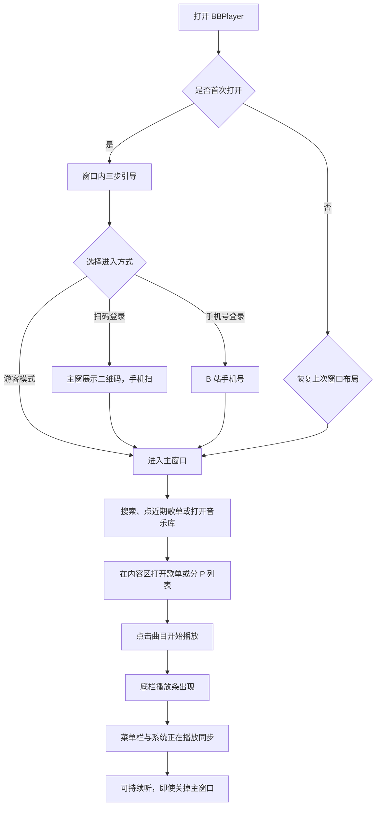
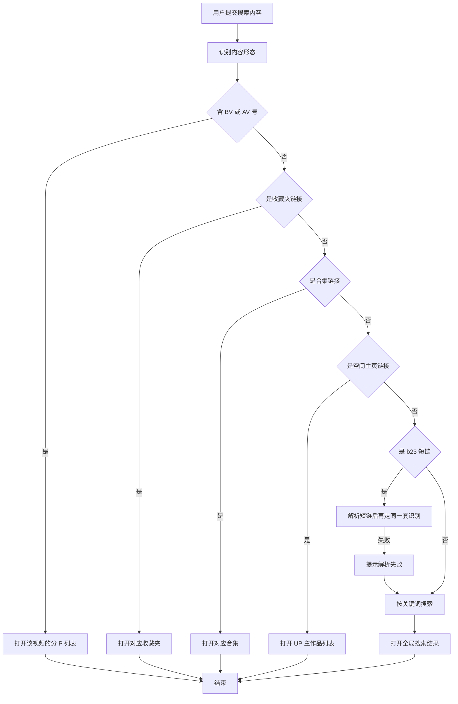
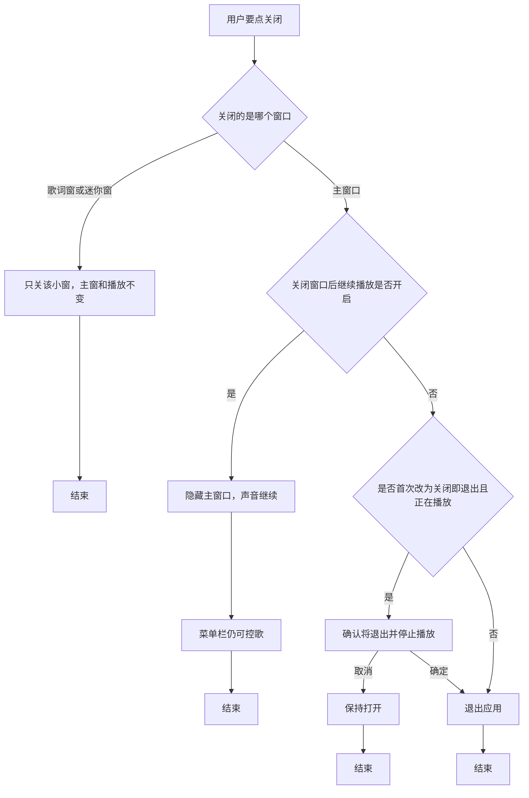

# BBPlayer 桌面端产品需求文档

> 文档读者：交互设计师、研发工程师、测试工程师  
> 覆盖范围：BBPlayer **macOS** 桌面客户端（第一期）  
> 能力原则：与 Android 版业务行为对齐，交互按桌面重做  
> 不包含：Windows / Linux 正式交付、整库云同步、无入口的弹幕能力

与 Android 版的划分见 [00-业务域划分说明.md](./00-业务域划分说明.md)。下文自包含，不要求先读完移动端文档才能实现或测试。

---

## 产品概述

BBPlayer 桌面端是同一款**本地优先的 Bilibili 音频播放器**在 Mac 上的形态。它面向已经在电脑前听歌、写东西、打游戏的人：他们需要一边做事一边听 B 站收藏夹或自己的歌单，用键盘和媒体键控歌，把歌词浮在别的窗口上面，而不是把手机支架支在键盘旁，也不想为听一首收藏夹里的歌打开臃肿的 B 站网页。

产品要解决的问题与 Android 版相同——B 站不是音乐 App——但场景从「通勤单手」变成「电脑多任务」：

- 窗口可以让到一边，播放不能停。
- 歌词要能脱离主窗、始终置顶，对应手机上的桌面歌词，且不必申请悬浮窗权限。
- 搜索框要接得住从浏览器复制来的 BV、短链、收藏夹链接。
- 关主窗不等于退出：用户点红灯通常只是想腾出屏幕。

核心价值主张：

- **听歌，而不是看视频**：完整播控、队列、循环/随机、断点续播、响度均衡。
- **内容仍来自 B 站**：登录后用收藏夹、合集、稍后再看；未登录也能搜索、打开公开链接、维护本地歌单。
- **歌词是一等公民**：自动匹配、逐字、翻译/罗马音；主窗内歌词页 + 可分离置顶歌词窗 + 菜单栏当前句。
- **本地优先**：歌单、缓存、歌词、播放历史在这台 Mac 上；换机靠备份包；共享歌单靠 BBPlayer 账号恢复。
- **可被装扮**：搜索并应用 B 站主题装扮，替换侧栏图标、启动画面、进度条拖拽、头像框等。
- **像一台 Mac 应用**：菜单栏控制、程序坞、媒体键、键盘快捷键、系统「正在播放」。

目标用户：

| 角色                  | 是谁                                                | 主要诉求                                             |
| --------------------- | --------------------------------------------------- | ---------------------------------------------------- |
| 游客听歌用户          | 未登录 B 站、也未注册 BBPlayer 账号                 | 粘贴链接搜歌、建本地歌单、键盘控歌、下缓存           |
| B 站登录用户          | 已用扫码/手机号/Cookie 登录 B 站                    | 收藏夹、合集、稍后再看、上报观看进度                 |
| 歌单协作者            | 已注册 BBPlayer 账号                                | 共享/订阅/协同；换电脑后恢复共享歌单                 |
| 进阶玩家              | 需要置顶歌词、菜单栏控歌、装扮、导出音频的 Mac 用户 | 多窗口、快捷键、备份与导出                           |
| 从 Android 迁来的用户 | 已有手机版备份包或共享歌单                          | 用备份包导入本机库，或登录 BBPlayer 账号拉回共享列表 |

产品边界：

- **第一期只做 macOS**。Windows 不在本期范围，PRD 中的程序坞、菜单栏、红灯行为均按 Mac 惯例描述。
- **不做整库云同步**。Android 与 Mac 之间搬家走备份包；共享歌单走现有云端。
- **没有付费墙**。捐赠为自愿打赏。
- **不替代 B 站客户端或网页**：无投稿、私信、动态流；评论区仅浏览与点赞。
- **不把手机底部三 Tab 原样放大**：主结构是侧栏 + 内容 + 底栏播放条。

---

## 用户故事

| 角色                  | 用户故事                                                                                      |
| --------------------- | --------------------------------------------------------------------------------------------- |
| 游客听歌用户          | 作为游客，我想要跳过登录直接用，以便在不愿承担账号风控时仍能搜歌和听歌。                      |
| 游客听歌用户          | 作为游客，我想要把从浏览器复制的 BV、短链或空间页链接粘贴进搜索框，以便系统自动打开对应内容。 |
| 游客听歌用户          | 作为游客，我想要用空格和媒体键播放暂停、用快捷键切歌，以便不把鼠标移回播放器也能控歌。        |
| 游客听歌用户          | 作为游客，我想要点窗口红灯后音乐仍在菜单栏继续，以便腾出屏幕写东西。                          |
| 游客听歌用户          | 作为游客，我想要把歌词拆成始终置顶的小窗，以便对着别的软件跟唱。                              |
| 游客听歌用户          | 作为游客，我想要新建本地歌单并把搜到的歌加进去，以便形成自己的听歌清单。                      |
| 游客听歌用户          | 作为游客，我想要缓存音频后在无网时继续听，以便断网也能播已缓存曲。                            |
| 游客听歌用户          | 作为游客，我想要从网易云或 QQ 音乐歌单导入并匹配到 B 站视频，以便把已有歌单迁过来。           |
| B 站登录用户          | 作为 B 站用户，我想要在 Mac 上显示二维码、用手机扫码登录，以便不必在电脑上输密码。            |
| B 站登录用户          | 作为 B 站用户，我想要看到自己的收藏夹、合集和稍后再看，以便和手机上同一份库对齐。             |
| B 站登录用户          | 作为 B 站用户，我想要把在线收藏夹同步成本地歌单，以便离线听并增量更新。                       |
| B 站登录用户          | 作为 B 站用户，我想要把本地歌单同步回 B 站收藏夹，以便官方客户端也能看到。                    |
| 歌单协作者            | 作为歌单主人，我想要登录 BBPlayer 账号后开启共享，以便把链接发给朋友。                        |
| 歌单协作者            | 作为订阅者，我想要点网页「在 BBPlayer 中订阅」或在 Mac 上粘贴链接，以便打开桌面端完成订阅。   |
| 从 Android 迁来的用户 | 作为手机用户，我想要导出备份包并在 Mac 上导入，以便歌单和设置搬家。                           |
| 进阶玩家              | 作为 Mac 用户，我想要搜索并应用 B 站装扮，以便侧栏和启动画面换成自己喜欢的皮肤。              |
| 进阶玩家              | 作为 Mac 用户，我想要把已缓存歌曲导出成带封面和歌词的音频文件，以便拷给朋友或其他播放器。     |
| 所有用户              | 作为用户，我想要在设置里关闭匿名统计，以便完全停止数据上传。                                  |

---

## 核心业务概念

业务取值与 Android 版相同。下列仅列出定义；桌面端不发明新的歌单类型或登录体系。

### 曲目来源

| 取值     | 含义                                                                   |
| -------- | ---------------------------------------------------------------------- |
| Bilibili | 对应一个 B 站稿件。单 P 整首对应一个视频；分 P 每一 P 是一首独立曲目。 |
| 本地     | 仅作元数据占位。当前不提供「把本机音频文件当曲目导入」的完整能力。     |

### 歌单类型

| 取值           | 含义                          | 用户能做什么                                                                    |
| -------------- | ----------------------------- | ------------------------------------------------------------------------------- |
| 本地歌单       | 本机构建的清单                | 增删改排序、改信息、缓存、共享、同步到 B 站                                     |
| 动态合并歌单   | 多源实时只读拼盘              | 播放、搜索、下载、复制为普通本地歌单；不能直接改曲目、不能共享、不能同步到 B 站 |
| 收藏夹同步副本 | B 站收藏夹的本地镜像          | 增量同步、改显示名/封面/描述、改歌曲显示名；不能直接增删曲目                    |
| 合集同步副本   | B 站合集/季节的本地镜像       | 同上                                                                            |
| 分 P 同步副本  | 一个分 P 视频拆成多首后的镜像 | 同上                                                                            |

### 在线内容入口

音乐库内四个分段，对应 Android 的四个页签，在桌面端用**分段控件或侧栏子项**呈现，文案不变：

| 分段     | 含义                                                                        |
| -------- | --------------------------------------------------------------------------- |
| 播放列表 | 本地歌单、动态合并歌单、同步副本                                            |
| 收藏夹   | 当前 B 站账号下的收藏夹。标题以 `[mp]` 开头的夹不出现在这里，改走「分 p」。 |
| 合集     | 当前账号订阅/追更的合集。                                                   |
| 分 p     | 来自标题以 `[mp]` 开头的收藏夹。点击进入分 P 列表，而不是直接当一首歌播放。 |

### 共享角色

| 取值   | 含义                                                                                     |
| ------ | ---------------------------------------------------------------------------------------- |
| 创建者 | 开启共享的人。可改歌单信息、改曲目、重置邀请码、查看成员、删除云端歌单。开启后不可撤销。 |
| 编辑者 | 通过带邀请码的协作链接加入。可加歌、删歌、改顺序，不能改标题/封面/描述，不能重置邀请码。 |
| 订阅者 | 通过普通订阅链接加入。只读同步，可播放和缓存。                                           |
| 未共享 | 普通本地歌单，不参与云端。                                                               |

### 循环模式

每点一次循环：关闭 → 单曲循环 → 列表循环 → 关闭。随机是独立开关，可与循环同时开。

### 下载任务状态

排队中、下载中、已完成、失败、已停止、移除中/重启中。含义与 Android 相同。已完成时曲目旁出现已缓存标记；播放器状态显示「正在播放 (已缓存)」。

同时下载数量默认 **1 个（稳妥）**，可选 2、3、**6 个（最快）**。

### 歌词来源

| 取值       | 含义                             |
| ---------- | -------------------------------- |
| 网易云音乐 | 默认。逐字与罗马音能力最完整。   |
| QQ 音乐    | 改走 QQ 音乐匹配。               |
| 酷狗音乐   | 改走酷狗匹配。                   |
| 自动       | 谁先返回用谁，**不比较匹配度**。 |

手动搜索不受此设置限制。副轨为翻译、罗马音；与主歌词时间轴匹配率不足则丢弃副轨。

### 播放器背景样式

| 取值     | 含义                 |
| -------- | -------------------- |
| 渐变     | 默认。根据封面取色。 |
| 默认背景 | 使用系统表面色。     |

不再提供会拖垮性能的动态背景。若从 Android 备份包恢复到该历史选项，导入后回退为「渐变」，并提示：「因为会对性能造成较大影响…已为您回退到渐变模式」。

### 桌面端窗口与外壳概念（本期新增）

| 取值               | 含义                                                               |
| ------------------ | ------------------------------------------------------------------ |
| 主窗口             | 侧栏 + 内容区 + 底栏播放条。关闭主窗口默认**不退出**应用。         |
| 播放器视图         | 主窗口内容区中的「正在播放」页，含封面、主控、可滑到歌词。         |
| 歌词窗口           | 独立小窗，可置顶、锁定位置，对应 Android 桌面歌词。                |
| 迷你窗口           | 更小的控歌窗，只保留封面、标题、播放/切歌。                        |
| 菜单栏控制         | 菜单栏图标：播放/暂停、上一首/下一首、当前标题；可选显示当前歌词。 |
| 关闭窗口后继续播放 | 默认开。点红灯或「关闭窗口」只藏主窗，声音和菜单栏仍在。           |
| 关闭窗口即退出     | 可选。点红灯等于退出 BBPlayer。                                    |

Android 上的「词幕 / SuperLyric / 魅族状态栏歌词」「车载歌词」「底部播放条悬浮/沉浸」**不出现在 Mac 设置里**。它们分别被菜单栏当前句、系统「正在播放」、主窗底栏吸收。

### B 站扫码与手机号

扫码状态文案与 Android 相同：正在生成二维码… / 等待扫码 / 已扫码，等待确认 / 二维码已过期 / 登录成功。  
手机号步骤：输入手机号 → 人机验证 → 输入验证码 → 成功。

---

## 核心业务流程

### 总流程：从打开到开始听歌

Mac 上用户常常先看到一个窗口，而不是一块全屏手机。引导做成窗口内居中卡片；登录后进入带侧栏的主窗。只要队列有曲，底栏播放条、菜单栏控制、系统媒体键同时可用。



流程说明：

1. 仅当本机标记「尚未完成首次打开」时进入引导。必须点「继续」或第三步的登录/游客，不能靠关掉窗口算完成引导；若用户在引导中点红灯，下次启动仍从引导开始。
2. 扫码或手机号结束引导后进入对应登录页；成功后进入主窗口。游客模式直接进主窗口。
3. 搜索、音乐库、粘贴链接、分享网页唤起、通知点击，最终都是「内容区打开一份列表 → 点播」。
4. 有当前曲目后：底栏播放条显示；菜单栏出现控制（若未关闭该功能）；系统「正在播放」显示封面与标题。
5. 默认点红灯只隐藏主窗口，播放继续。菜单栏图标仍可暂停、切歌、点「显示主窗口」。

### 分支：智能搜索

识别规则与失败文案与 Android 完全相同，桌面端额外把「剪贴板粘贴」和「把链接拖到窗口」当成与回车提交等价的入口。



流程说明：

- 只有普通关键词写入「最近搜索」，最多 10 条。
- 「链接中未找到 ctype 参数，你确定复制全了吗？」
- 「解析 b23.tv 短链接失败」/「未能从短链解析出已识别内容（BV/作者/收藏等）」
- 「解析 avid 失败」
- 从访达或浏览器一次拖入多条链接：提示「收到多个共享内容，已忽略」，只处理第一条。
- 主窗口在前时，快捷键「聚焦搜索」把光标放到搜索框；若剪贴板是链接，允许用户直接粘贴提交。

### 分支：登录 B 站

与 Android 相同：扫码、手机号、Cookie 三种方式写入同一套登录态，解锁收藏夹、合集、分 p、稍后再看。

Mac 上**推荐扫码**：电脑显示二维码，用已登录 B 站的手机扫。手机号与 Cookie 仍保留，给不愿扫码或二维码失败的人。

未登录时，音乐库「收藏夹 / 合集 / 分 p」显示：「登录 bilibili 账号后才能查看合集」和「登录」按钮。游客仍可搜索公开内容、打开他人收藏夹/合集链接。

### 分支：在线内容同步到本地、共享歌单

业务步骤与 Android 相同（见后文模块）。桌面端差异只有入口位置：同步按钮在内容区歌单头部；共享在歌单菜单；订阅可走网页深链唤起桌面端，或音乐库加号「订阅共享歌单」。

### 分支：关闭窗口与退出

这是桌面端相对手机最大的生命周期差异。手机划掉任务往往等于停播；Mac 点红灯通常只是不想看到窗口。



菜单「退出 BBPlayer」始终真正退出：停播、卸菜单栏图标、结束进程。  
程序坞图标右键「退出」与菜单退出相同。  
程序坞点击：主窗口若已隐藏则重新显示。

首次使用默认「关闭窗口后继续播放」时，第一次点红灯后用一次性说明：「关闭窗口后将继续在菜单栏播放。可在设置中改为关闭即退出。」按钮「知道了」。不阻断关闭。

---

## 状态流转

下载任务、共享同步队列、循环模式的状态图与 Android 相同。

下载：排队中 → 下载中 → 已完成 / 失败 / 已停止；失败可重试；已完成可删缓存。  
共享：待同步 → 同步中 → 完成 / 失败；冲突后写赢（以用户操作时间较晚者为准）。  
循环：关闭 → 单曲 → 列表 → 关闭。

主窗口可见性是桌面端额外状态，不影响下载与同步：隐藏主窗口时后台下载、共享上传、歌词窗口、菜单栏控制都继续。

---

## 功能清单

| 模块           | 能力摘要                                                            |
| -------------- | ------------------------------------------------------------------- |
| 应用外壳       | 主窗口、侧栏、菜单栏控制、程序坞、迷你窗口、关闭/退出、键盘与媒体键 |
| 首次引导       | 欢迎、账号风险、扫码/手机号/游客                                    |
| 主页           | 问候、头像、搜索、热力图、快捷入口、近期歌单、清爽模式              |
| 智能搜索       | BV/AV、短链、收藏夹/合集/空间链接、关键词、历史与建议、粘贴与拖放   |
| 播放器视图     | 播控、循环随机、队列、倍速、定时关闭、下载、评论                    |
| 歌词           | 自动匹配、逐字、翻译/罗马音、编辑、偏移、歌词窗口、菜单栏当前句     |
| 音乐库         | 播放列表 / 收藏夹 / 合集 / 分 p；已下载；排行榜                     |
| 本地歌单       | 新建、编辑、排序、置顶、复制、删除、搜索曲目、整单缓存              |
| 动态合并歌单   | 多源只读合并、去重、复制为普通歌单                                  |
| 在线内容       | 收藏夹/合集/分 P/稍后再看/UP 主/搜索结果；同步到本地                |
| 外部歌单导入   | 网易云 / QQ 匹配到 B 站后存为本地歌单                               |
| 共享歌单       | 开启共享、订阅、协作、成员、云同步、网页唤起                        |
| 下载与导出     | 任务队列、已下载、导出带封面歌词的音频文件                          |
| 播放历史       | 周热力图、按日明细、全部统计、最近常听、那月今日                    |
| 评论区         | 浏览精选/最新、看回复和图片、点赞；不能发评                         |
| 主题装扮       | 搜索装扮、下载、切换/删除、启动画面与部件开关                       |
| Bilibili 账号  | 扫码、手机号、Cookie、退出、上报观看进度                            |
| BBPlayer 账号  | 注册登录、资料、用 B 站资料填充、恢复共享歌单                       |
| 外观与播放设置 | 频谱、清爽模式、背景、续播、响度、自动播放、与其他软件同时播放      |
| 桌面外壳设置   | 关闭窗口行为、菜单栏控制、菜单栏显示歌词、歌词窗口置顶与锁定        |
| 通用           | 隐私、展开分 P、日志、检查更新、封面补全、备份导入导出              |
| 更新           | 发现新版本、跳过、强制更新、下载安装                                |
| 关于与捐赠     | 版本、官网、GitHub、许可证、微信/支付宝                             |
| 深链           | 共享歌单网页唤起、`打开 BBPlayer` 协议                              |

---

## 功能模块详述

### 1. 应用外壳与主窗口

电脑前听歌的人需要「主界面在时能管库，不在时还能控歌」。外壳把 Android 的底部导航改成侧栏，把通知栏控歌改成菜单栏和媒体键，并把「桌面歌词」做成真正的独立窗口。

#### 主窗口布局

```
┌──────┬──────────────────────────────────────┐
│ BBPlayer          搜索…          [头像]     │  ← 标题栏区域
├──────┼──────────────────────────────────────┤
│ 主页 │                                      │
│ 音乐库│           内容区                     │
│ 设置 │                                      │
│      │                                      │
│      │                                      │
├──────┴──────────────────────────────────────┤
│ [封面] 标题  作者    进度    随机 上 播 下 循环│  ← 底栏播放条
└──────────────────────────────────────────────┘
```

侧栏三项固定为「主页」「音乐库」「设置」，装扮可以换图标，不能改名称、不能增删项、不能把它们藏掉。选中项在内容区切换，不新开主窗口。

底栏播放条始终贴在主窗口底部（有当前曲时显示）。点击封面或标题打开内容区中的播放器视图。播放/暂停、上一首、下一首、随机、循环直接可点。右键播放条可「打开队列」「打开歌词窗口」「打开迷你窗口」。

#### 菜单栏控制

存在价值：主窗口关掉或被挡住时，用户仍要暂停和切歌，而不把 BBPlayer 找回来。

- 图标点击展开：当前封面、标题、作者、播放/暂停、上一首、下一首。
- 可选「菜单栏显示歌词」：图标旁或展开面板显示当前句；无歌词时显示标题。
- 「显示主窗口」「打开歌词窗口」「退出 BBPlayer」。
- 设置中可关闭整个菜单栏控制。关闭后，点红灯若仍选择继续播放，则只能靠媒体键、程序坞菜单或再次从程序坞打开主窗口控歌。关闭菜单栏控制时，若「关闭窗口后继续播放」仍开着，第一次组合使用需提示：「已关闭菜单栏控制，关闭主窗口后请用媒体键或程序坞控歌。」

#### 程序坞

- 点击：显示主窗口并置于最前。
- 右键：播放/暂停、上一首、下一首、显示主窗口、退出 BBPlayer。
- 有当前曲时可在程序坞菜单看到标题（过长截断）。
- 进度不在程序坞图标上做环形进度，避免做成装饰大于功能。

#### 迷你窗口

存在价值：用户想留一条窄控歌条在桌面一角，但不需要完整主窗。

- 默认大小仅容纳封面、标题两行、三个主按钮。
- 可始终置顶（跟随歌词窗口的置顶开关，或迷你窗自己的「置顶」）。
- 关闭迷你窗不影响播放。
- 双击封面：显示主窗口并打开播放器视图。

#### 系统菜单（始终存在）

| 菜单     | 项                                                                                  |
| -------- | ----------------------------------------------------------------------------------- |
| BBPlayer | 关于 BBPlayer、设置…、隐藏、退出 BBPlayer                                           |
| 文件     | 导入数据…、导出数据…、关闭窗口                                                      |
| 编辑     | 撤销/剪切/复制/粘贴（在输入框内按系统默认）                                         |
| 播放     | 播放/暂停、上一首、下一首、循环（子菜单：关闭/单曲/列表）、随机、打开队列、定时关闭 |
| 窗口     | 显示主窗口、播放器、歌词窗口、迷你窗口、最小化                                      |
| 帮助     | 官网指南、检查更新                                                                  |

菜单项与界面按钮操作同一套能力，文案与快捷键一致。

#### 键盘与媒体键

焦点在搜索框、评论输入以外的文本框时，下列全局于应用内生效；媒体键在应用为当前媒体会话时可在其他应用前生效（系统允许的前提下）。

| 操作             | 快捷键                               | 失败               |
| ---------------- | ------------------------------------ | ------------------ |
| 播放/暂停        | 空格                                 | 无当前曲则无效果   |
| 上一首 / 下一首  | 左方向 / 右方向；媒体键上一曲/下一曲 | 队列空则无效果     |
| 快退 / 快进 5 秒 | Shift+左 / Shift+右                  | 无当前曲则无效果   |
| 聚焦搜索         | Command+L                            | —                  |
| 打开设置         | Command+,                            | —                  |
| 打开歌词窗口     | Option+Command+L                     | —                  |
| 打开迷你窗口     | Option+Command+M                     | —                  |
| 关闭当前窗口     | Command+W                            | 主窗走关闭窗口规则 |
| 退出             | Command+Q                            | 停止播放并退出     |

空格在搜索框内必须输入空格，不得误触播放。

#### 系统「正在播放」

播放时向系统提供封面、标题、作者、进度、播放/暂停。锁屏和控制中心应能控歌。菜单栏「显示歌词」打开时，**不**用歌词覆盖系统标题（避免控制中心里变成一句歌词找不到歌名）；歌词只出现在 BBPlayer 自己的菜单栏控制和歌词窗口。

这对应 Android「车载歌词」要解决的「别的屏幕也看到当前句」，但 Mac 上歌名优先给系统，歌词优先给自己的歌词通道。

---

### 2. 首次引导

电脑端同样必须先讲清账号风险，不能把扫码画成无成本。Mac 上扫码反而更顺：二维码显示在电脑上，手机去扫。

#### 页面布局

引导是主窗口内居中卡片，窗口本身不可当成「已完成」。

```
┌──────────────────────────────────────────┐
│                                          │
│           [ 图标 / 盾牌 / 火箭 ]          │
│           标题                           │
│           说明                           │
│           （第三步三个按钮）              │
│                                          │
│              ● ○ ○                       │
│              [ 继续 ]                    │
└──────────────────────────────────────────┘
```

| 步  | 标题                | 正文/操作                                                                                                                                             |
| --- | ------------------- | ----------------------------------------------------------------------------------------------------------------------------------------------------- |
| 1   | 欢迎使用 / BBPlayer | 「你的 BiliBili 音乐伴侣」换行「开源 · 简洁 · 纯粹」。按钮「继续」。                                                                                  |
| 2   | 安全提示            | 即使谨慎调用 B 站能力，**仍不保证**账号安全；可能风控、短期或永久封禁。选「游客模式」仍可使用本地播放列表、搜索、查看合集等大部分功能。按钮「继续」。 |
| 3   | 准备开始            | 「扫码登录」（主按钮）、「手机号登录」、「游客模式」。无「继续」。                                                                                    |

第二、三步有「返回」。成功写入「已完成首次打开」。

---

### 3. 主页与智能搜索

主页仍承担「认识你、帮你找到下一首」。桌面端搜索更常用于粘贴浏览器链接，所以搜索框在窗口顶栏也常驻一份（与主页大搜索同步内容）：用户不必先点「主页」才能搜。

清爽模式：内容区只留问候、头像与大搜索，隐藏热力图、快捷入口、近期歌单；顶栏搜索仍在。

#### 内容区布局（默认）

```
┌─────────────────────────────────────────┐
│ BBPlayer          [顶栏搜索]    [头像]  │
│ 早上好，{昵称或陌生人}              [!] │
│ ┌─────────────────────────────────────┐ │
│ │ 关键词 / b23.tv / 完整网址 / av / bv │ │
│ └─────────────────────────────────────┘ │
│ 周热力图                                │
│ 那月今日    最近常听    稍后再看         │
│ 近期歌单                                │
│ [封面] 标题     n 首                    │
└─────────────────────────────────────────┘
```

问候规则与 Android 相同：凌晨好 / 早上好 / 下午好 / 晚上好 + 「，{B 站昵称}」或「，陌生人」。  
头像点击进入 Bilibili 账号页，可叠装扮头像框。  
同步失败告警点击打开失败列表。  
稍后再看仅已登录 B 站时显示。  
近期歌单：封面、标题、「n 首」。

搜索建议、历史最多 10 条、清空/删除确认文案与 Android 相同：

- 「清空搜索历史？」「确定要清空吗？」取消/确定
- 「删除搜索历史？」「确定要删除「{该条文字}」吗？」
- 空历史：「暂无搜索历史」
- placeholder：「关键词 / b23.tv / 完整网址 / av / bv」

顶栏搜索与主页搜索是同一套提交逻辑，避免两套历史。

---

### 4. 播放器视图与队列

播放器是「正在听」中枢。桌面端不默认再盖一层手机那样的全屏页，而是在内容区打开播放器视图；用户仍可以把歌词拆走。

#### 布局

```
┌─────────────────────────────────────────┐
│ [返回]  正在播放(已缓存)          [更多] │
│                                         │
│     [ 封面 ]          标题              │
│                       作者              │
│                       进度条            │
│              随机  上一  播放  下一  循环│
│              评论              队列     │
│                                         │
│     或右侧/下一页为歌词                  │
└─────────────────────────────────────────┘
```

宽窗口下：左封面右信息；窄窗口下改为上下堆叠。点封面或「歌词」切换到歌词页。状态：「正在播放」或「正在播放 (已缓存)」。

主控、更多菜单项与 Android 对齐：

高频：倍速、定时关闭、下载/重新下载。  
列表：添加到 bilibili 收藏夹（B 站曲）、添加到本地歌单、编辑信息、查看作者、查看视频详情（B 站曲）、搜索歌词、分享歌词、分享歌曲、打开歌词窗口。

相关提示沿用：

- 「获取视频详细信息失败」
- 「已添加到下载队列」
- 「获取内部播放地址失败」
- 「下载音频失败」
- 「当前仅支持分享 Bilibili 来源的歌曲」

#### 播放队列

侧滑或按钮打开「播放队列 (n)」。可跳转、移除、保存为本地歌单。作者缺省「未知作者」。

- 「添加到下一首播放成功」
- 「只能将单曲插入到下一首播放，已取消本次操作。」
- 「点击列表中的单曲会直接替换当前播放列表，是否继续？」可勾选下次不再提醒
- 「没有可播放的歌曲」

#### 倍速

标题「播放速度」。预设 0.5 / 0.75 / 1.0 / 1.25 / 1.5 / 2.0。「当前: {x}x」。自定义 0.1–5.0。非法：「请输入有效的播放速度」。

#### 定时关闭

预设 15 / 30 / 45 / 60 分钟，可自定义。「剩余 HH:MM:SS」。到点暂停。成功：「设置定时器成功」「取消定时器成功」。

#### 播放错误

| 场景               | 提示                                          |
| ------------------ | --------------------------------------------- |
| 验证码             | Bilibili 触发验证码，请尝试重新登录或稍后再试 |
| 未登录且源需要登录 | Bilibili 账号未登录                           |
| 无流/下架/大会员   | 无法获取音频流，可能需要大会员或该歌曲已下架  |
| 离线未缓存         | 当前歌曲未缓存，离线状态下无法播放            |
| 网络失败           | 网络连接失败，请检查网络设置                  |
| 其他               | 播放器发生未知错误                            |
| 登录失效           | 登录状态失效，请重新登录                      |

---

### 5. 歌词

电脑上歌词的核心场景是「对着别的窗口看当前句」。因此主窗歌词页负责精读和编辑，歌词窗口负责置顶跟唱，菜单栏负责一眼扫到。

#### 主窗歌词页

加载失败：「歌词加载失败：{原因}」。无时间轴则「原始歌词：」「翻译歌词：」。点某行跳转时间。长按或选句分享，最多 5 句：「最多选择 5 句歌词」「请先选择歌词」。

菜单：切换罗马音/翻译、编辑歌词、时间轴偏移、在歌词窗口打开。

编辑字段：主歌词、翻译、罗马音。成功：「歌词保存成功」。清除：「歌词已清除」；确认时说明清除后跳过自动获取。格式错误可「仍要保存」。偏移步进 0.5 秒。

自动匹配、清除后跳过自动抓取、副轨合并规则与 Android 相同。

分享卡片：生成后可「保存到文件」或系统共享。无照片图库权限时改为选保存位置，不使用「请允许访问相册」；若用户选了导出到照片且被拒，提示「无法保存图片」。成功保存文件：「已保存」。

#### 歌词窗口（对应 Android 桌面歌词）

存在价值：主窗口被挡住时仍要看到当前句，并就地暂停、切歌。

- 独立窗口，默认始终置顶。
- 可拖动；「歌词窗口锁定」后不可拖动，防止误触。
- 可调字号、颜色。
- 点击歌词区域可展开小型播控。
- 无歌词时显示歌曲标题。
- **不申请「悬浮窗权限」**，也不出现 Android 那两段授权文案。关闭置顶后窗口可被挡住。
- 关闭歌词窗口不等于关闭歌词功能；下次可用菜单、快捷键或播放器「打开歌词窗口」再开。
- 设置「桌面歌词」开关：开则播放时自动打开歌词窗口；关则不自动打开，已打开的窗口保持到用户关掉。

启动时若上次退出前歌词窗口开着，恢复其位置与置顶状态。

#### 菜单栏当前句

设置「菜单栏显示歌词」默认关，避免菜单栏被长句占满。开启后显示当前句，过长截断。无歌词时回退到歌曲标题。

不提供词幕、SuperLyric、魅族框架选项，也没有「未检测到可用环境，请点击查看配置文档」。

#### 歌词设置

| 项                 | 默认       | 说明                                                                                 |
| ------------------ | ---------- | ------------------------------------------------------------------------------------ |
| 显示逐字歌词       | 开         |                                                                                      |
| 恢复旧版歌词样式   | 关         |                                                                                      |
| 播放时打开歌词窗口 | 关         | 对应 Android「桌面歌词」的自动出现                                                   |
| 歌词窗口置顶       | 开         |                                                                                      |
| 歌词窗口锁定       | 关         |                                                                                      |
| 菜单栏显示歌词     | 关         |                                                                                      |
| 自动匹配的歌词源   | 网易云音乐 | 选「自动」时说明：选择最先返回的数据源，但不会考虑匹配度，所以不保证结果一定是最好的 |

---

### 6. 音乐库

四个分段与 Android 页签一一对应，放在内容区顶部，便于宽屏同时看到列表。右上角仍是已下载、排行榜。

```
┌─────────────────────────────────────────┐
│ 音乐库                    [下载] [奖杯] │
│ 播放列表  收藏夹  合集  分 p            │
│ {标题}              {n} 个…        [+]  │
│ [搜索播放列表]                          │
│ 列表…                                   │
└─────────────────────────────────────────┘
```

播放列表：计数「{n} 个播放列表」；搜索「搜索播放列表」；空「没有播放列表」；失败「加载失败」。已登录时顶部虚拟项「稍后再看」。加号：新建播放列表、导入外部歌单、订阅共享歌单、动态合并歌单。

新建弹层标题「创建播放列表」，字段标题（必填）、描述、封面；空标题「标题不能为空」；取消/确定。从加号创建成功进入该歌单并「创建播放列表成功」。从「添加到本地歌单」中途新建则不跳转。

收藏夹 / 合集 / 分 p 未登录引导与 Android 相同。分 p 找不到 `[mp]` 夹：「未找到分 P 视频收藏夹，请先创建一个收藏夹，并以 [mp] 开头」。

---

### 7. 本地歌单与在线内容

头部信息、按钮、菜单、曲目菜单、只读规则、离线灰显、同步与删除确认**全部与 Android 对齐**，包括：

- 「n 首歌曲」或「n 首 ( m 首失效)」
- 「最后同步：{相对时间}」
- 菜单：排序、编辑播放列表信息、同步到 B 站、设为共享歌单、共享设置、置顶/取消置顶、删除播放列表
- 删除标题「删除播放列表」；创建者追加「同时所有订阅过该播放列表的人也会失去访问权限。」；编辑者/订阅者追加「同时你也会失去访问权限，下次需要由共享歌单的人再次邀请。」
- 曲目：下一首播放、添加到本地歌单、查看详细信息、查看 up 主作品、缓存音频/删除缓存、复制封面链接、编辑信息、删除歌曲（「确定？」「确定从列表中移除该歌曲？」）
- 「添加到下一首播放成功」「已开始下载」「删除缓存成功」「已复制到剪贴板」「你已经在这里了，没法更深入了！」「未找到 up 主信息」
- 动态合并：至少两个源；不能以动态歌单为源；成功「动态合并歌单已创建」
- 在线头部主按钮「同步到本地」/「重新同步」
- 稍后再看删除：「删除成功」「清除稍后再看列表成功」
- 收藏夹凭据过期：「删除失败：csrf token 过期，请检查 cookie 后重试」

桌面差异：双击曲目播放；三击或回车等同单击菜单默认项「播放」；右键打开曲目菜单（对应手机的更多）。拖拽排序仅可编辑的本地歌单可用。

分 P 默认仍播第 1 P；详情列出全部分 P；同步时询问是否展开，之后在「通用 → 同步时展开分 P 视频」修改。

---

### 8. 外部歌单导入与共享歌单

导入弹层「输入外部歌单信息」，字段「歌单 ID / 链接」，来源「网易云音乐 / QQ音乐」。匹配页可手动改匹配、立即保存。文案：匹配完成 / 匹配出错 / 已暂停匹配 / 歌单已保存到本地 / 没有可保存的内容。

共享使用 **BBPlayer 账号**，不可撤销。成功「已开启共享」；可复制订阅链接、协作编辑链接；重置邀请码。「已复制订阅链接」「已复制协作编辑链接」「已生成新的编辑者邀请码」。

订阅预览前 30 首。有邀请码按钮「加入协作编辑」，否则「订阅共享歌单」。成功「订阅成功」。云端已删：「共享歌单不存在或已删除」。创建者删除后他人：「共享者已删除该歌单，已为你移除本地副本」。

网页「在 BBPlayer 中订阅」：已安装则打开桌面端落地页；未安装则引导到官网/GitHub 下载 Mac 版本（不要引导去 Android 安装包）。

权限表：

| 动作                   | 创建者     | 编辑者 | 订阅者             |
| ---------------------- | ---------- | ------ | ------------------ |
| 播放、缓存、同步到本机 | 是         | 是     | 是                 |
| 加歌、删歌、改顺序     | 是         | 是     | 否                 |
| 改标题/封面/描述       | 是         | 否     | 否                 |
| 重置邀请码             | 是         | 否     | 否                 |
| 查看成员               | 是         | 是     | 否                 |
| 退出                   | 必须删歌单 | 可退出 | 可退出并删本地副本 |
| 删云端歌单             | 是         | 否     | 否                 |

登录 BBPlayer 后：「已恢复 {n} 个共享歌单」或「云端共享歌单已同步」；失败「同步云端共享歌单失败」。查看成员未登录：「登陆 BBPlayer 账号后才能查看共享成员」。

---

### 9. 下载、已下载与导出

下载任务页：「下载任务」「总共 {n} 个任务」「重试失败」「全部清除」。

已下载：搜索「搜索已下载歌曲」；多选后导出、删除、下一首播放。

导出在 Mac 上**作为正式能力交付**（不再提示「仅支持 Android」）。通过系统文件夹选择器选定保存位置。可配文件名、是否内嵌歌词、是否裁剪封面。进度：「导出设置 / 导出完成 / 导出失败」。没有可导出项：「没有可导出的歌曲」。

缓存仍在应用私有目录，访达默认不可见，这是导出存在的原因。通用设置提供「下载缺失封面」，避免导出无封面。

---

### 10. 播放历史、评论、装扮

热力图、那月今日、最近常听、全部统计的入口、空态、文案与 Android 相同。全部统计只计完整播放。

评论：播放器评论按钮进入「评论区」；可看精选/最新、楼中楼和图片；可点赞「点赞成功」「取消点赞成功」；不能发评。桌面端评论在内容区打开，可用 Command+W 回到上一页。

主题：设置 → 主题 → 添加主题。动态主题无已装皮肤时不可开。资产：海报、应用主题、滑块、点赞动画、刷新动画、头像框。关闭单项有对应「已关闭…」提示。搜索只支持收藏集和主题装扮；不支持：「暂时无法下载」「当前只支持下载收藏集和主题装扮。」进度：「正在下载主题资产」→「下载完成」/「下载失败」。

装扮替换侧栏图标、启动画面、进度条拖拽、点赞动画、页头背景、头像框。不能把侧栏三项改名或藏掉。

---

### 11. Bilibili 账号与 BBPlayer 账号

#### B 站

未登录：「连接 Bilibili」；扫码登录、手机号登录、添加 Cookie。  
已登录：资料卡昵称、「UID {数字}」或「已保存 Cookie」。

| 项           | 说明                                             |
| ------------ | ------------------------------------------------ |
| 上报观看进度 | 默认关。「播放 Bilibili 来源歌曲时同步观看记录」 |
| 重新扫码登录 | 「适合在当前 Cookie 失效后重新授权」             |
| 手机号登录   | 「使用短信验证码登录 Bilibili」                  |
| 修改 Cookie  | 「手动粘贴或清空 Bilibili Cookie」               |

退出：「退出 Bilibili 账号？」「退出后收藏夹、稍后再看和播放记录上报等功能会暂停。」成功「Bilibili 账号已退出」。

扫码页在 Mac 上二维码更大，便于手机扫。失败文案：获取二维码失败 / 获取二维码登录状态失败 / 保存 Cookie 失败：…

手机号校验与成功文案与 Android 相同。Cookie：空则「Cookie 已清除」；更新「Cookie 已更新」；非法字符自动修复。

#### BBPlayer 账号

登录/注册、用户名非空、密码至少 8 位、小写用户名。过程与结果文案与 Android 相同，包括用 B 站资料填充。两套账号互相不登录对方。

---

### 12. 设置

设置在侧栏第三项，同时可用 Command+, 打开。分组与 Android 大体相同，去掉手机系统专属项，加上窗口外壳项。

```
┌─────────────────────────────────────────┐
│ 设置                                    │
│ 外观     播放器样式、显示模式            │
│ 主题     动态皮肤、侧栏、启动画面        │
│ 播放     播放行为、音效设置              │
│ 歌词     歌词源、歌词窗口、菜单栏歌词    │
│ 下载     相关设置                        │
│ 桌面     关闭窗口、菜单栏、迷你窗        │
│ Bilibili 账号  {状态}                    │
│ BBPlayer 账号  {状态}                    │
│ 通用     更新、日志、备份                │
│ 捐赠支持 请开发者喝杯咖啡                │
│ 关于 BBPlayer 版本、许可证               │
└─────────────────────────────────────────┘
```

#### 外观

| 项                 | 默认 | 说明                                                                                       |
| ------------------ | ---- | ------------------------------------------------------------------------------------------ |
| 显示音频频谱       | 关   | 开启后封面变圆。需麦克风时走系统授权；拒绝则保持关闭。说明分析音频、**不会录制任何声音**。 |
| 清爽模式           | 关   | 「开启后主页仅显示顶部搜索框，隐藏其他推荐及历史组件」                                     |
| 选择播放器背景样式 | 渐变 | 「渐变」「默认背景」                                                                       |

无「底部播放条样式」。

#### 播放

与 Android 相同四项：恢复上次播放进度；响度均衡（实验性）；软件启动时自动播放（易社死）；允许与其他软件同时播放。失败「设置失败」。

#### 桌面（本期新增页）

| 项                  | 默认 | 说明                                                       |
| ------------------- | ---- | ---------------------------------------------------------- |
| 关闭窗口后继续播放  | 开   | 关则红灯等于退出                                           |
| 显示菜单栏控制      | 开   |                                                            |
| 开机后启动 BBPlayer | 关   | 跟随用户登录启动，不自动出声；出声仍受「启动自动播放」约束 |
| 启动时打开迷你窗口  | 关   |                                                            |

#### 通用

| 项                              | 默认       | 行为                                                                                                                                |
| ------------------------------- | ---------- | ----------------------------------------------------------------------------------------------------------------------------------- |
| 分享数据（崩溃报告 & 匿名统计） | 开         | 切换后「重启？」需重启完全生效                                                                                                      |
| 同步时展开分 P 视频             | 未设置当关 |                                                                                                                                     |
| 打开 Debug 日志                 | 关         |                                                                                                                                     |
| 分享今日运行日志                | —          | 系统共享；找不到则失败                                                                                                              |
| 检查更新                        | —          | 见更新                                                                                                                              |
| 下载缺失封面                    | —          |                                                                                                                                     |
| 清空图片缓存                    | —          | 「已清空图片缓存」                                                                                                                  |
| 导出数据                        | —          | 系统另存为对话框；成功「已导出」；失败「导出失败」                                                                                  |
| 导入数据                        | —          | 选 Android 或 Mac 导出的备份包。「恢复完成」「数据已恢复，需要重启应用才能完全生效。是否立即重启？」稍后/立即重启。失败「导入失败」 |

不提供「开发者页面」给普通设置列表。不出现「请允许 BBPlayer 安装未知来源应用后再次更新」。

备份包格式与 Android 互通：Android 导出的包可在 Mac 导入；Mac 导出的包可在 Android 导入。导入后若含 Mac 没有的设置项则忽略；若含已废除的播放器背景则回退渐变并提示。

---

### 13. 更新、关于、捐赠、深链

更新：通用设置或帮助菜单「检查更新」。弹层「发现新版本 {版本号}」；默认说明「提高软件稳定性，优化软件流畅度」。非强制可跳过；强制「此更新为强制更新，必须安装后继续使用。」已最新「已是最新版本」。失败「检查更新失败」。下载完成后走 Mac 常规安装（替换应用并重启），成功可提示「更新包下载完成」。失败把下载链接写入剪贴板：「更新失败，已将下载链接复制到剪贴板」。

关于：「又一个 Bilibili 音乐播放器」；版本「v{版本}:{构建号}」；官网、GitHub、许可证。

捐赠：自愿；微信/支付宝显示收款码，可保存为图片文件。

深链：共享歌单网页唤起已安装的 Mac 应用。通知（若系统允许）点击显示主窗口并打开播放器视图。

找不到的内容区路径：「404」「你正在找的页面不见了！」「回到主页」。

---

## 用户角色与权限矩阵

| 能力                                         | 游客 | 仅 B 站登录 | 仅 BBPlayer 登录 | 两者都登录 |
| -------------------------------------------- | ---- | ----------- | ---------------- | ---------- |
| 搜索公开内容、BV/链接直达                    | 是   | 是          | 是               | 是         |
| 本地歌单增删改、缓存、歌词、播放器           | 是   | 是          | 是               | 是         |
| 菜单栏、歌词窗口、媒体键、关闭窗口后继续播放 | 是   | 是          | 是               | 是         |
| 音乐库收藏夹/合集/分 p/稍后再看              | 否   | 是          | 否               | 是         |
| 把歌加到 B 站收藏夹、上报观看进度            | 否   | 是          | 否               | 是         |
| 开启/订阅/协同共享、换机恢复共享列表         | 否   | 否          | 是               | 是         |
| 搜索下载 B 站装扮                            | 是   | 是          | 是               | 是         |
| 导入 Android 备份包                          | 是   | 是          | 是               | 是         |
| 关闭匿名统计                                 | 是   | 是          | 是               | 是         |

共享内部角色见共享模块表。动态合并、B 站同步副本、共享订阅副本对曲目列表只读或仅允许同步。

---

## 业务规则与约束

1. **本地优先**：歌单、缓存、歌词、统计写在这台 Mac。无 BBPlayer 账号则换机不会自动出现，只能靠备份包。
2. **两套账号分离**：B 站登录不创建 BBPlayer 账号，反之亦然。
3. **与 Android 业务行为一致**：同一用户操作的成功/失败条件、歌单只读边界、共享不可撤销、冲突后写赢、预览 30 首、分 P 默认第 1 P、`[mp]` 隐藏规则、搜索历史 10 条、歌词源默认网易云、清除歌词跳过自动抓、完整播放才计总时长、上报进度默认关、统计默认可关、响度只衰减、启动自动播放默认关、同时播放默认关。
4. **关闭窗口默认不停播**；退出菜单才停播。
5. **菜单栏控制默认开**；歌词不写入系统「正在播放」的标题。
6. **导出音频在 Mac 上可用**。
7. **备份包与 Android 互通**。
8. **同时下载数默认 1**，可改为 2/3/6。
9. **无付费功能**。
10. **第一期不做 Windows**。

可配置项默认值：

| 配置                       | 默认               |
| -------------------------- | ------------------ |
| 上报观看进度               | 关                 |
| 逐字歌词                   | 开                 |
| 旧版歌词样式               | 关                 |
| 歌词源                     | 网易云音乐         |
| 播放时打开歌词窗口         | 关                 |
| 歌词窗口置顶               | 开                 |
| 歌词窗口锁定               | 关                 |
| 菜单栏显示歌词             | 关                 |
| 显示菜单栏控制             | 开                 |
| 关闭窗口后继续播放         | 开                 |
| 开机后启动                 | 关                 |
| 启动时打开迷你窗口         | 关                 |
| 音频频谱                   | 关                 |
| 清爽模式                   | 关                 |
| 播放器背景                 | 渐变               |
| 同时下载数                 | 1                  |
| 匿名统计                   | 开                 |
| 调试日志                   | 关                 |
| 允许同时播放               | 关                 |
| 同步展开分 P               | 未设置（界面当关） |
| 续播 / 响度 / 启动自动播放 | 出厂关或安全默认   |

---

## 异常流程与边界处理

| 场景               | 触发            | 策略                             | 反馈                                                 |
| ------------------ | --------------- | -------------------------------- | ---------------------------------------------------- |
| B 站登录过期       | 请求未登录      | 引导重新登录                     | 「登录状态失效，请重新登录」                         |
| 未登录访问 B 站库  | 收藏夹等        | 拒绝                             | 「请先登录 Bilibili 账号」                           |
| 未登录共享         | 开启/订阅       | 拒绝                             | 「请先登录 BBPlayer 账号」                           |
| 离线点未缓存曲     | 无网无缓存      | 不播放，列表灰显                 | 「当前歌曲未缓存，离线状态下无法播放」               |
| 无流/下架          | 取流失败        | 该曲不可播                       | 「无法获取音频流，可能需要大会员或该歌曲已下架」     |
| 验证码             | B 站风控        | 停止本次                         | 「Bilibili 触发验证码，请尝试重新登录或稍后再试」    |
| 链接无法识别       | 搜索            | 提示或回落关键词                 | 见搜索文案                                           |
| 空标题             | 保存歌单        | 拒绝                             | 「标题不能为空」                                     |
| 共享已删           | 打开或同步      | 移除本地副本                     | 「共享者已删除该歌单，已为你移除本地副本」           |
| 同步失败           | 上传失败        | 主页告警                         | 失败列表展示操作类型                                 |
| 无法保存图片       | 保存分享图被拒  | 不保存                           | 「无法保存图片」                                     |
| 麦克风被拒         | 开频谱          | 保持关闭                         | 封面不变圆                                           |
| 一次拖入多条链接   | 拖放/分享       | 只处理第一条                     | 「收到多个共享内容，已忽略」                         |
| 非法 Cookie        | 粘贴换行        | 自动修复                         | 提示已自动修复                                       |
| 引导未完成就关窗   | 点红灯          | 下次仍引导                       | 不写入首次完成                                       |
| 关了菜单栏还关主窗 | 继续播放开着    | 允许，一次性说明用媒体键或程序坞 | 见外壳模块                                           |
| 备份缺 Mac 设置    | 从 Android 导入 | 忽略未知项，缺省用 Mac 默认      | 不报失败                                             |
| 部分歌曲加删失败   | 批量            | 成功的保留                       | 「部分歌曲添加失败，请查看日志」「部分歌曲删除失败」 |
| 检查更新失败       | 网络            | 保持当前版本                     | 「检查更新失败」                                     |
| 焦点在搜索框按空格 | 输入            | 插入空格，不切换播放             | —                                                    |

---

## 非功能性需求

### 用户体验

- 跟随系统浅色/深色。控件按桌面密度排布：列表行可高于手机，但不要把手机卡片原样放大。
- 装扮可换侧栏图标与启动画面，不能破坏「主页 / 音乐库 / 设置」可发现性。
- 空态与失败必须有文案。
- 启动自动播放必须保留「易社死」类风险提示。
- 危险操作可取消。
- 快捷键与菜单必须有同一条路径，避免有的能力只藏在右键里。

### 搜索

- 顶栏搜索与主页搜索同一套策略。
- 库内另有搜索播放列表、收藏夹内容、歌单内歌曲、已下载。

### 多端

- **本期只验收 macOS。**
- 业务规则与 Android 对齐；外壳按 Mac 惯例。
- 备份包双向导入导出。
- 共享深链在 Mac 上打开桌面端，未安装引导桌面下载。

### 安全与隐私

- 引导必须展示账号风险。
- 共享用 BBPlayer 账号，不把 B 站 Cookie 传到共享服务。
- 匿名统计可关，关后重启完全生效。
- 频谱若用麦克风，必须说明不录音。

### 性能与播放

- 支持队列连续播放、边听边缓存、离线缓存。
- 不提供高耗动态播放器背景。
- 同时下载默认 1。
- 隐藏主窗口后播放卡顿不得明显高于主窗口可见时。

### 更新与分发

- 以 GitHub / 官网提供的 Mac 安装包为主，应用内检查更新。
- 强制更新必须挡住继续使用直到装完。

---

## 术语表

| 术语               | 含义                                              |
| ------------------ | ------------------------------------------------- |
| 本地优先           | 核心数据先存在这台电脑，云端只服务共享和更新      |
| 同步副本           | 从 B 站收藏夹/合集/分 P 拉下来的本地歌单          |
| 动态合并歌单       | 多个源歌单的实时只读拼盘                          |
| 分 P               | 一个视频下的多个分段                              |
| `[mp]` 收藏夹      | 标题以此前缀开头、用来查看全部分段的收藏夹        |
| SPL                | 兼容 LRC、支持逐字与翻译/罗马音的歌词格式         |
| 歌词窗口           | Mac 上可置顶的独立歌词小窗，对应 Android 桌面歌词 |
| 菜单栏控制         | 屏幕顶部菜单栏里的 BBPlayer 控歌入口              |
| 关闭窗口后继续播放 | 点红灯只藏主窗，声音不停                          |
| 稍后再看           | B 站稍后再看列表在 BBPlayer 中的入口              |
| 装扮               | B 站主题/收藏集资源                               |
| BBPlayer 账号      | 只用于共享与云端恢复共享列表的独立账号            |
| 完整播放           | 从开头到结尾，中途切走不算                        |
| 清爽模式           | 主页只留搜索相关区域                              |
| 响度均衡           | 把不同曲目听感拉近，实验性                        |
| 备份包             | 可在 Android 与 Mac 之间搬家的数据包              |

---

## 验收要点

### 端到端主路径

1. 全新安装 → 引导三步文案齐全 → 游客进入主页问候为「陌生人」→ 粘贴 BV 打开分 P → 点播 → 底栏播放条出现 → 空格可暂停（焦点不在输入框）。
2. 引导选扫码 → Mac 显示二维码 → 登录成功 → 音乐库出现收藏夹 → 同步到本地 → 无网仅已缓存可播。
3. 点红灯 → 声音继续 → 菜单栏可暂停 → 点程序坞恢复主窗口。Command+Q 停止并退出。
4. Option+Command+L 打开置顶歌词窗口；锁定后不可拖动；关闭小窗播放不停。
5. 新建本地歌单 → 添加到本地歌单 → 播放全部 → 随机与列表循环 → 队列保存为新歌单。
6. 自动歌词 → 手动搜索保存 → 清除后不再自动抓。
7. 缓存单曲 → 「正在播放 (已缓存)」→ 已下载可搜到 → 导出得到可播放音频文件。
8. 注册 BBPlayer 账号 → 设为共享 → 另一台设备（或本机另一用户）订阅 → 预览最多 30 首 → 全量可播。
9. 从 Android 导出备份 → Mac 导入 → 歌单出现 → 提示重启 → 重启后库仍在。
10. 关闭「分享数据」→ 重启确认 → 重启后不再上报。
11. 检查更新：已最新 / 可跳过 / 强制不可关。

### 角色与权限

- 游客只能看到收藏夹登录引导。
- 仅 B 站登录不能开启共享。
- 仅 BBPlayer 登录不能看自己的 B 站收藏夹。
- 退出 B 站确认文案提到收藏夹、稍后再看、上报会暂停。

### 桌面外壳

- 循环三次点击回到关闭。
- 搜索框内空格不切换播放。
- 媒体键在系统允许时可在其他应用前控歌。
- 系统「正在播放」显示歌名而非歌词。
- 关闭菜单栏控制后，继续播放仍成立，并出现一次性说明。
- 引导未完成时关窗，下次仍引导。
- 装扮不能去掉侧栏三项。
- 不出现词幕/SuperLyric/魅族、未知来源安装、底部播放条悬浮/沉浸等 Android 专属设置。

### 与 Android 对齐的边界

- `[mp]` 夹只出现在分 p。
- 搜索失败文案与本文一致。
- 分享歌词超过 5 句被拒绝。
- 倍速超出 0.1–5.0 被拒绝。
- 动态合并少于两个源被拒绝。
- 共享不可撤销。
- 创建者删云端后订阅端移除副本。

### 明确不验收

- Windows / Linux 安装包与快捷键。
- 整库云同步（本地歌单自动出现在手机上）。
- 弹幕。
- 付费解锁。
- 用 B 站 Cookie 登录共享服务。
- 把本机音乐文件当曲目导入。
