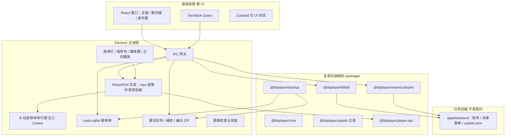

# BBPlayer 桌面端技术方案

> 配套产品文档：[02-BBPlayer桌面端.md](./02-BBPlayer桌面端.md)  
> 代码落点：原仓库 [bbplayer-app/BBPlayer](https://github.com/bbplayer-app/BBPlayer) monorepo（`dev` 分支）  
> 原则：**业务/数据/协议尽量复用；UI 全部新建；播放引擎在 Mac 上重做并对齐现有 Orpheus 契约**

本文给研发做架构与拆包决策，不替代逐任务实施清单。实现时应在原仓库新增 `apps/desktop` 与若干 `packages/*`，而不是另起独立仓库复制逻辑。

---

## 1. 目标与约束

### 1.1 目标

在 macOS 上交付与 Android **业务行为一致** 的 BBPlayer：同一套歌单模型、B 站协议、共享账号、备份包、歌词匹配规则。用户从 Android 导出的备份可在 Mac 导入歌单与设置快照。

### 1.2 硬约束

| 项   | 约定                                                                                     |
| ---- | ---------------------------------------------------------------------------------------- |
| 仓库 | 继续用现有 pnpm monorepo，不新建平行代码库                                               |
| UI   | 不复用 `apps/mobile` 的页面、组件、expo-router、React Native Paper、底栏、热力图 RN 组件 |
| 播放 | 不把 `@bbplayer/orpheus`（Media3 / AVFoundation Expo Module）编进 Mac                    |
| 平台 | 第一期只做 macOS；Windows 预留接口但不交付                                               |
| 数据 | 共用同一套 Drizzle schema 与备份 `manifest.version = 1`                                  |
| 后端 | 继续用现有 Cloudflare Worker；桌面走主进程请求，不依赖浏览器 CORS                        |
| 账号 | B 站 Cookie 与 BBPlayer JWT 两套分离，共享服务不接收 Cookie                              |

### 1.3 明确不复用

- `@bbplayer/orpheus` 原生实现（Android Media3、iOS AVFoundation、悬浮窗/状态栏歌词、Media3 DownloadManager）
- `@bbplayer/native`（APK 安装、写 Downloads）
- `expo-wavy-slider`、`react-native-bottom-tabs`、`@bbplayer/heatmap` UI
- `@bbplayer/image-theme-colors` 的 Expo 原生取色（可换 Node 实现、保持函数语义）
- Firebase Analytics RN、Sentry RN、expo-router 导航

---

## 2. 总体架构

桌面端拆成三层：**渲染进程（新 UI）**、**主进程（系统能力）**、**共享包（从 mobile 抽出的业务）**。播放、SQLite、B 站拉流、Cookie 都放在主进程，避免渲染进程碰到跨域、密钥和文件锁。



职责：

- **渲染进程**：只画界面、发意图（播放这首、打开这个歌单）、订阅播放进度与列表查询结果。不持有 Cookie 明文的长期存储（可读脱敏后的登录态）。
- **主进程**：实现 `PlayerPort`、打开 SQLite、跑 facades/services、写歌词 JSON、导出导入备份、菜单栏与媒体键。
- **共享包**：无 React、无 Expo。通过注入的 `AuthProvider`、`FsPort`、`Db`、`PlayerPort` 工作。mobile 后续可迁过来，但第一期允许 mobile 仍走旧路径，避免一次大爆炸重构。

---

## 3. 运行时选型

### 3.1 结论：Electron + React（第一期）

| 方案                 | 复用 TypeScript 业务                       | Mac 窗口/菜单栏                                | 音频与 SQLite                                   | 风险                           |
| -------------------- | ------------------------------------------ | ---------------------------------------------- | ----------------------------------------------- | ------------------------------ |
| **Electron + React** | 主进程直接跑 Drizzle / JSZip / hono client | Tray、Dock、globalShortcut、Media Session 成熟 | better-sqlite3；mpv/ffmpeg 易集成               | 安装包偏大                     |
| Tauri 2 + React      | 业务需 Node sidecar 或把逻辑重写成 Rust    | 更原生、包体小                                 | SQLite 容易；B 站流与 Cookie 代理要在 Rust 重做 | 与现有 TS 堆栈分叉，复用率下降 |
| react-native-macos   | 可能误复用 RN 组件                         | 差                                             | Orpheus 仍不能用                                | 违反「UI 除外」且生态弱        |
| 纯 SwiftUI           | 几乎无法复用 `lib/`                        | 最佳                                           | 需重写全部协议                                  | 违反复用原则                   |

第一期选 **Electron** 的原因：现有可抽逻辑全是 TypeScript（drizzle-orm、neverthrow、hono/client、JSZip、arktype）。主进程等于一个 Node 宿主，抽出的包几乎不用改语言。包体和内存在后续可评估 Tauri，但不要第一期就双栈。

渲染层用 **React + 自选桌面 UI 库**（与 RN Paper 无关）。状态查询继续用 **TanStack Query**（mobile 已用），降低 hooks 迁移成本。

### 3.2 进程模型

| 进程             | 技术            | 窗口                     |
| ---------------- | --------------- | ------------------------ |
| main             | Node + Electron | 无窗口；管播放、DB、托盘 |
| renderer: main   | React           | 侧栏主窗口               |
| renderer: lyrics | React（轻量）   | 置顶歌词窗               |
| renderer: mini   | React（轻量）   | 迷你播放窗               |

三个 renderer 通过同一套 preload 调主进程，保证只有一份播放器与一份数据库。

---

## 4. 原仓库复用清单

### 4.1 原样依赖

| 包 / 目录                                 | 用法                                             |
| ----------------------------------------- | ------------------------------------------------ |
| `@bbplayer/splash`                        | SPL/LRC 解析、多轨合并、网易云逐字转换           |
| `@bbplayer/eslint-plugin`、根 oxlint/tsgo | 桌面包纳入同一套 lint                            |
| `apps/backend`                            | 登录、共享歌单、`GET /update.json`               |
| `apps/docs` 中 SPL 与业务规则说明         | 产品行为参照；安装指南需补 Mac                   |
| mobile `drizzle/*.sql`                    | 桌面 schema 在主进程 `src/main/db`；不抽成共享包 |

### 4.2 抽出后再复用（从 `apps/mobile/src` 搬）

| 来源                                                                                  | 目标包                                                | 改造点                                                |
| ------------------------------------------------------------------------------------- | ----------------------------------------------------- | ----------------------------------------------------- |
| `types/core/*`、`lib/services/genKey.ts`、`lib/errors/*`（去掉 UI 展示类）            | `@bbplayer/core`                                      | 无 React                                              |
| `utils/search.ts` 的 `matchSearchStrategies`                                          | `@bbplayer/core`                                      | **不要**带 `navigateWithSearchStrategy` / expo-router |
| `lib/db/schema.ts` + `drizzle/`                                                       | `apps/desktop/src/main/db`                            | 桌面用 `node:sqlite`，不与 mobile 共用包              |
| `lib/services/{playlist,track,artist}Service.ts`                                      | `apps/desktop/src/main/db`                            | `PlayerDatabase` 直接跑在主进程                       |
| `lib/api/bilibili/*`、网易云/QQ/酷狗 API                                              | `@bbplayer/bilibili`                                  | Cookie/WBI 改为 `AuthProvider`，去掉 `useAppStore`    |
| `lib/api/bbplayer/client.ts` + `lib/facades/sharedPlaylist.ts` + `PlaylistSyncWorker` | `@bbplayer/shared-playlist`                           | JWT 注入；去掉 toast                                  |
| `lib/facades/{playlist,bilibili,syncBilibiliPlaylist,syncExternalPlaylist}.ts`        | `@bbplayer/core` 或 `@bbplayer/bilibili` 的 facade 层 | toast → `Reporter` 端口                               |
| `lib/backup/*`                                                                        | `@bbplayer/backup`                                    | FS 端口化；`orpheus` 段改为 `PlayerBackupPort`        |
| `lib/services/lyricService.ts` 的匹配逻辑                                             | `@bbplayer/lyrics`（薄封装 splash）                   | 存储与 overlay 端口化                                 |
| `lib/player/PlayerSideEffects.ts` 的 `getPlayerErrorInfo`                             | `@bbplayer/player-api`                                | 错误码语义与 Android 文案对齐                         |
| `packages/orpheus/src/ExpoOrpheusModule.ts` 中的类型与方法名                          | `@bbplayer/player-api`                                | **只搬契约，不搬原生**                                |

### 4.3 语义复用、实现重写

| 能力                            | Android 现状             | Mac 做法                                                    |
| ------------------------------- | ------------------------ | ----------------------------------------------------------- |
| 播放/队列/下载                  | Orpheus + Media3         | `PlayerPort` + mpv（或 ffmpeg）+ 本地文件缓存               |
| `orpheus://bilibili?bvid=&cid=` | 原生解析并带 Cookie 拉流 | 主进程解析同一 URL 形态，走本地代理                         |
| 桌面歌词                        | 系统悬浮窗               | 独立 BrowserWindow，alwaysOnTop                             |
| 状态栏/车载歌词                 | 词幕/Flyme/媒体标题      | 菜单栏当前句 + 系统 Now Playing（标题仍用歌名）             |
| 备份写 Downloads                | `@bbplayer/native`       | `dialog.showSaveDialog`                                     |
| 应用更新                        | APK + 未知来源           | `update.json` 增加 mac 字段 + 下载 dmg/zip                  |
| 封面取色                        | image-theme-colors       | Node 取色，接口保持 `extractThemeColorAsync` 语义           |
| 热力图                          | RN SVG 组件              | 用同一套 `play_history` 聚合，桌面自绘                      |
| 设置持久化                      | RN MMKV `app-storage`    | electron-store 或 SQLite，**备份导入时按现有 key 结构解码** |

### 4.4 第一期允许暂不抽、桌面先 adapter 的部分

为避免阻塞 UI 开工，允许 `apps/desktop` 暂时 **复制并改 import** 尚未抽干净的 facade，但必须：

1. 目录标明 `src/vendor-bridge/`，禁止新 UI 直接 import `apps/mobile`。
2. 每个 bridge 文件顶部写清「应对应迁到哪个 package」。
3. 抽包完成后删除 bridge。

禁止桌面长期 `import '@bbplayer/mobile/src/...'`。

---

## 5. 共享包设计

### 5.1 `@bbplayer/player-api`

对齐 `packages/orpheus/src/ExpoOrpheusModule.ts` 的对外面，让现有 PlayerSideEffects、下载 UI 逻辑可以对着接口写，而不是对着 Media3 写。

最小契约（名称保持与 Orpheus 一致，便于对照）：

```ts
export enum PlaybackState {
	IDLE = 1,
	BUFFERING = 2,
	READY = 3,
	ENDED = 4,
}
export enum RepeatMode {
	OFF = 0,
	TRACK = 1,
	QUEUE = 2,
}

export interface PlayerTrack {
	id: string
	url: string
	title?: string
	artist?: string
	artwork?: string
	duration?: number
}

export interface PlayerPort {
	play(): Promise<void>
	pause(): Promise<void>
	seekTo(positionMs: number): Promise<void>
	skipToNext(): Promise<void>
	skipToPrevious(): Promise<void>
	addToEnd(tracks: PlayerTrack[]): Promise<void>
	playNext(track: PlayerTrack): Promise<void>
	removeTrack(id: string): Promise<void>
	clear(): Promise<void>
	getQueue(): Promise<PlayerTrack[]>
	getCurrentTrack(): Promise<PlayerTrack | null>
	setRepeatMode(mode: RepeatMode): Promise<void>
	setShuffle(enabled: boolean): Promise<void>
	setPlaybackSpeed(speed: number): Promise<void>
	setBilibiliCookie(cookie: string | null): Promise<void>
	downloadTrack(track: PlayerTrack): Promise<void>
	removeDownload(id: string): Promise<void>
	exportData(): Promise<{
		playerQueue: Record<string, string | number | boolean>
		loudness: Record<string, number>
	}>
	importData(data: {
		playerQueue?: Record<string, string | number | boolean>
		loudness?: Record<string, number>
	}): Promise<void>
}
```

事件与 Orpheus 对齐：`onPlaybackStateChanged`、`onTrackStarted`、`onTrackFinished`、`onPlayerError`、`onPositionUpdate`、`onIsPlayingChanged`、`onDownloadUpdated`、`onQueueChanged`。

Mac 实现不提供：`showDesktopLyrics`（改窗口）、`statusBarLyricsProvider`、`checkOverlayPermission`。这些方法在桌面绑定里直接标为不支持，UI 按 PRD 走窗口与菜单栏。

### 5.2 桌面歌单库（主进程 `src/main/db`）

- 不单独成 `@bbplayer/db`：歌单库只被 Electron 主进程使用，继续拆包没有必要。
- `PlayerDatabase`、`schema.ts` 与类型落在 `apps/desktop/src/main/db`，用 Node 内置 `node:sqlite`。
- 文件名桌面用 `~/Library/Application Support/BBPlayer/db.db`，与备份里的 `database.db` 逻辑相同，导入时仍 `VACUUM`/替换后重启连接。
- mobile 若以后要共用，再评估抽取；第一期不为此保留 workspace 包。

### 5.3 `@bbplayer/bilibili`

- WBI 签名、收藏夹/合集/分 P/稍后再看/搜索/流地址，从 `lib/api/bilibili` 原迁。
- `AuthProvider { getCookie(): string | null; getCsrf(): string | null }`。
- 登录失效码 `-101` 仍映射为「登录状态失效，请重新登录」，由桌面 UI 跳转扫码页。

### 5.4 `@bbplayer/backup`

保持现有 ZIP 结构，扩展名 `.bbplayer`：

```
database.db
manifest.json  {
  version: 1,
  exportedAt,
  mmkv: { "app-storage", "shared-playlist-members" },
  orpheus: { playerQueue, loudness }
}
```

桌面导入：

1. 校验 zip + `version === 1`。
2. 用 `database.db` 替换本机库（导入后跑齐尚未执行的迁移；若 Android 库版本更新，只快进不回退）。
3. 解码 `app-storage` JSON，写入 electron-store；未知键忽略，缺的 Mac 外壳设置用桌面默认（关闭窗口后继续播放 = 开，等）。
4. `orpheus` 交给 `PlayerPort.importData`。
5. 提示重启应用（与 Android 文案一致）。

已知缺口（与现网备份一致，不在第一期偷偷改 v1 格式）：歌词 JSON、离线音频、皮肤包不在 zip 内。若要补齐，另开 `manifest.version = 2` 并保证 Android 也能读 v1。

### 5.5 依赖方向

```
apps/mobile ──┐
              ├── @bbplayer/core
apps/desktop ─┤   @bbplayer/bilibili
              │   @bbplayer/splash
              │   @bbplayer/backup
              │   @bbplayer/player-api     （mobile 的实现类包一层 Orpheus）
              └── @bbplayer/shared-playlist
```

桌面歌单库在 `apps/desktop/src/main/db`，不进入共享包。

`apps/mobile` 与 `apps/desktop` **互不 import**。

---

## 6. 桌面应用内部结构

建议路径（均在原仓库）：

```
apps/desktop/
  package.json                 # @bbplayer/desktop
  electron-builder.yml
  src/main/
    index.ts                   # 生命周期、单例锁
    ipc.ts                     # 白名单 channel
    player/
      MpvPlayer.ts             # PlayerPort
      BilibiliMediaProxy.ts    # 127.0.0.1 带 Cookie 拉流
      DownloadStore.ts
    db/                        # PlayerDatabase、schema、类型
    tray.ts
    nowPlaying.ts              # Media Session / Now Playing
    updater.ts
    deepLink.ts                # bbplayer://
  src/preload/index.ts
  src/renderer/
    main/                      # 主窗口 UI
    lyrics/
    mini/
  resources/
```

IPC 只暴露领域命令，例如 `playlist.list`、`player.play`、`auth.setCookie`，禁止通用 `eval` 或任意 SQL。

---

## 7. 播放与缓存

### 7.1 为何不能沿用 Orpheus

`packages/orpheus` 的 `expo-module.config.json` 只有 android/ios。Android 管线是 Media3 ExoPlayer + DownloadManager；iOS 是不完整的 AVFoundation。没有 macOS target，也没有把 Media3 编到 Mac 的路径。

### 7.2 推荐实现

1. **解码播放**：主进程内嵌 **mpv**（libmpv 或打包 mpv 二进制）。它对 DASH/m4s/AAC 支持好，seek 与倍速现成，适合 B 站音频流。
2. **鉴权拉流**：不把 Cookie 交给渲染进程的 `<audio src="https://...">`。由 `BilibiliMediaProxy` 在本机起仅 loopback 的 HTTP，播放器只播 `http://127.0.0.1:{port}/play?key=...`。上游请求带 Cookie，逻辑对齐原生 `setBilibiliCookie`。
3. **URL 形态**：继续使用 `orpheus://bilibili?bvid=&cid=`（或同等 query），方便备份队列与 facades 不用改 uniqueKey。
4. **离线缓存**：完成文件放在 `Application Support/BBPlayer/downloads/{uniqueKey}`；边听边缓存用临时文件，完成后再标记 `DownloadState.COMPLETED`。并行数设置项与 Android 相同（默认 1，可选 2/3/6）。
5. **响度**：有 B 站响度元数据时按现逻辑只衰减、目标约 -14 LUFS；结果写入 `loudness` map 以便备份互通。
6. **导出 m4a**：主进程用 ffmpeg 封装封面、标签、内嵌歌词；目录用系统选择器。这是 PRD 要求的 Mac 正式能力。

错误文案必须走抽出来的 `getPlayerErrorInfo` 同类映射，保持：验证码、未登录、大会员/下架、离线未缓存、网络失败等中文提示不变。

### 7.3 与系统外壳

| PRD 能力           | 技术落点                                                           |
| ------------------ | ------------------------------------------------------------------ |
| 菜单栏控制         | `Tray` + 菜单；可选当前句                                          |
| 关闭窗口后继续播放 | `mainWindow.hide()`；`app.quit` 仅菜单「退出」或设置关闭           |
| 媒体键             | `globalShortcut` 或 `media-key` / Media Session                    |
| 系统正在播放       | Electron `navigator.mediaSession` 或原生桥；**标题用歌名不是歌词** |
| 歌词窗口置顶       | `BrowserWindow({ alwaysOnTop: true })`                             |
| 开机启动           | `app.setLoginItemSettings`                                         |

---

## 8. 登录、扫码、更新

### 8.1 B 站

- 扫码、短信、Cookie 的 HTTP 调用复用 `@bbplayer/bilibili`。
- 二维码在渲染进程展示，轮询在主进程，避免休眠节流。
- Cookie 只存主进程安全存储（safeStorage 加密）。渲染进程只拿「已登录 / 昵称 / UID」。

### 8.2 BBPlayer 账号

- 继续 `hono/client` + `AppType`。
- **所有请求从主进程发出**，不依赖 Worker CORS 白名单。
- 若未来要用渲染进程直连，必须给 Worker 增加桌面 origin；第一期不做。

### 8.3 更新清单

现有 `GET /update.json` 面向 Android APK。扩展字段（示例，保持旧客户端仍能读原字段）：

```json
{
	"version": "2.7.0",
	"notes": "…",
	"forced": false,
	"downloads": {
		"android": { "arm64-v8a": "https://…" },
		"macos": { "universal": "https://…/BBPlayer-mac.zip" }
	}
}
```

桌面 `updater.ts` 只看 `downloads.macos`；Android 忽略该键。强制更新逻辑与 PRD 一致。

---

## 9. UI 层（不复用 mobile）

新写，但 **文案、校验、空态、失败提示以桌面 PRD 为准**，并与 Android 已有字符串对齐。

| 窗口   | 内容                                          |
| ------ | --------------------------------------------- |
| 主窗口 | 侧栏 主页 / 音乐库 / 设置；内容区；底栏播放条 |
| 歌词窗 | 当前句、逐字、置顶/锁定                       |
| 迷你窗 | 封面、标题、三键                              |

推荐：主窗口路由用轻量客户端路由（不必上 expo-router）。播放状态通过 IPC 订阅，三个窗口共享同一播放源。

皮肤：下载与资源包逻辑可复用 mobile `SkinManager` 的解析规则（在 bridge 中去 Expo FS），绘制用 CSS/Canvas，不引入 RN Skia。

---

## 10. 分阶段交付

阶段之间都应可运行、可测；不要等「整个 lib 抽完」再开窗口。

### 阶段 A — 壳与播放证明

- `apps/desktop` Electron 跑起来：主窗、隐藏关窗、Tray、空格播放占位。
- `PlayerPort` + 本地文件或公开音频能播。
- 定义 IPC 白名单。

**完成标准**：关主窗音乐不停，菜单栏可暂停。

### 阶段 B — 抽核与搜播

- 落地 `@bbplayer/core`、`@bbplayer/bilibili`；歌单库放主进程 `src/main/db`。
- 游客：搜索 BV/关键词、打开分 P、点播走 B 站代理。
- SQLite 写入 tracks/playlists。

**完成标准**：不登录能搜 BV 并听；uniqueKey 规则与 Android 一致。

### 阶段 C — 库与账号

- 本地歌单 CRUD、同步收藏夹、Cookie/扫码登录。
- 歌词匹配（splash + 网易云/QQ/酷狗）+ 歌词窗。
- 下载缓存、已下载页。

**完成标准**：登录后看到收藏夹并同步成本地歌单；无网可播已缓存。

### 阶段 D — 对齐 PRD 剩余

- 共享歌单（现有 backend）。
- 外部歌单导入。
- 备份导入导出（含从 Android v1 zip 导入）。
- 装扮、评论只读、历史热力图、导出 m4a、检查更新、深链。

**完成标准**：桌面 PRD 验收清单可逐条测。

### 阶段 E — mobile 切到共享包（可并行靠后）

- `apps/mobile` 改为依赖 `@bbplayer/core` 等共享包，删重复 `lib/`；歌单库仍可各端自持。
- Orpheus 上套一层 `PlayerPort`。
- 此阶段不阻塞桌面发布。

---

## 11. 测试策略

| 层                                          | 做法                                                               |
| ------------------------------------------- | ------------------------------------------------------------------ |
| `@bbplayer/core` 搜索策略、genKey、错误映射 | Node 单测，用例对齐现有中文文案                                    |
| 主进程 `src/main/db`                        | 对 schema 跑迁移；用临时 sqlite 测 `PlayerDatabase`                |
| `@bbplayer/backup`                          | 夹具：一份真实结构的 v1 zip（可脱敏）在 Node 里 round-trip         |
| 播放                                        | 主进程集成测：mock 代理返回本地 m4a；断言队列/循环/下载状态        |
| UI                                          | 不测 RN；桌面用组件测或 Playwright 控 Electron                     |
| 回归                                        | 与 Android 对照：同一 BV、同一收藏夹同步条数、同一备份导入后歌单数 |

---

## 12. 风险与对策

| 风险                       | 对策                                                     |
| -------------------------- | -------------------------------------------------------- |
| B 站拉流与 WBI 变更        | 协议集中在 `@bbplayer/bilibili`，两端同日修              |
| mpv 打包体积与公证         | 只带所需 lib；Apple 公证 + 硬链接运行时路径              |
| 抽包拖垮 Android 稳定性    | 阶段 E 靠后；桌面先用 vendor-bridge                      |
| 备份不含缓存/歌词          | PRD 已承认；导入后提示「音频缓存与歌词需重新获取」       |
| Electron 包大              | 第一期接受；列包体预算，不因此改 Tauri                   |
| 主进程事件风暴（进度 4Hz） | 进度节流后再 IPC；歌词窗可独立听 position                |
| 单实例与深链               | `requestSingleInstanceLock`；第二个实例把 URL 交给第一个 |

---

## 13. 与产品文档的对应

| PRD 模块                   | 技术方案落点                             |
| -------------------------- | ---------------------------------------- |
| 侧栏 / 红灯不停播 / 菜单栏 | Electron 壳，阶段 A                      |
| 智能搜索                   | `@bbplayer/core` matchSearchStrategies   |
| 播放器/队列/倍速/定时      | PlayerPort                               |
| 歌词窗 / 菜单栏句          | splash + 独立窗口；非 Orpheus overlay    |
| 音乐库与同步               | 主进程歌单库 + bilibili facades          |
| 共享                       | `@bbplayer/shared-playlist` + 现 backend |
| 备份互通                   | `@bbplayer/backup` 保持 v1               |
| 更新                       | update.json 增 macos                     |
| 不出现词幕/未知来源        | 桌面设置不实现这些 IPC                   |

---

## 14. 建议的第一批仓库改动（文件级）

在原仓库、且尚未写业务 UI 时先做这些，避免桌面从一开始就 import mobile：

1. 新增 `packages/player-api`（仅类型与事件，无原生）。
2. 新增 `packages/core`，迁入 `genKey`、`matchSearchStrategies`、核心类型。
3. 新增 `apps/desktop` 最小 Electron 壳。
4. `pnpm-workspace` 已包含 `apps/*`，desktop 自动入仓。
5. 根 `update.json` / Worker 文档注明 macos 字段为后续，不在阶段 A 改线上 KV。

mobile 的 `lib/` 在阶段 B/C 按文件迁出，每次迁出保持 Android 测试通过。
